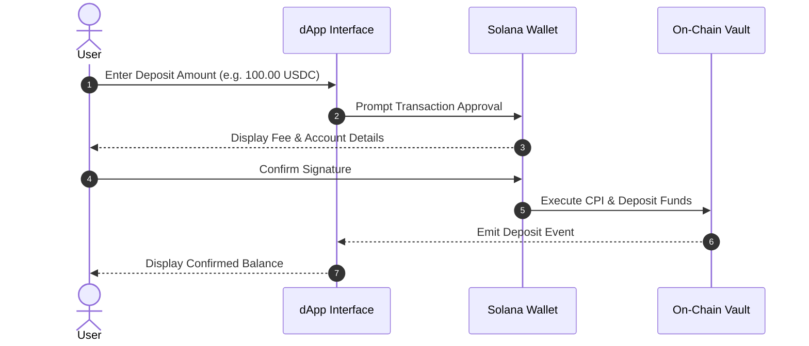

# Information Architecture & Navigation Taxonomy for dApp Documentation

## Overview

A well-structured Web3 dApp documentation site guides users from basic onboarding to complex protocol interactions without overwhelming them. This reference provides exact directory schemas, sidebar configurations, and content templates for building production-grade dApp documentation.

---

## Standard Directory Schema

Enforce the following directory structure for your documentation repo (e.g., inside `docs/` for Docusaurus or GitBook):

```
docs/
├── 1-getting-started/
│   ├── index.md                   # Welcome & Protocol Overview
│   ├── wallet-setup.md            # Setting up Phantom / Solflare / Web3 Wallets
│   ├── acquiring-sol.md           # Getting SOL / Native Tokens for Network Fees
│   └── connecting-and-safety.md   # Connecting Wallet & Signature vs. Transaction Safety
├── 2-protocol-mechanics/
│   ├── overview.md                # Core Architecture & Tokenomics
│   ├── deposit-and-yield.md       # Vault Deposits, Prize Draws, & Yield Sources
│   ├── swapping.md                # DEX Swaps, Route Optimization, & Slippage
│   ├── lending-and-borrowing.md   # Collateral Ratios, Liquidation, & Interest Rates
│   └── risk-disclosures.md        # Smart Contract Risks & Impermanent Loss
├── 3-in-app-help/
│   ├── microcopy-dictionary.md    # Approved Terminology & Copy Standards
│   ├── contextual-tooltips.md     # In-App Tooltip & Modal Specifications
│   └── transaction-states.md      # UI State Machine & Status Feedback
└── 4-troubleshooting-and-support/
    ├── index.md                   # Troubleshooting Hub & Self-Service Guide
    ├── common-errors.md           # Hex / Program Error Translation Table
    ├── stuck-transactions.md      # Unstucking Pending Transactions & RPC Selection
    ├── security-and-phishing.md   # Official Links & Phishing Safety
    └── faq.md                     # Frequently Asked Questions
```

---

## Docusaurus Sidebar Configuration Template

When using Docusaurus, define `sidebars.js` with clear category groupings, collapsed defaults, and icon metadata:

```javascript
// sidebars.js
module.exports = {
  docsSidebar: [
    {
      type: "category",
      label: "🚀 Getting Started",
      collapsible: false,
      items: [
        "1-getting-started/index",
        "1-getting-started/wallet-setup",
        "1-getting-started/acquiring-sol",
        "1-getting-started/connecting-and-safety",
      ],
    },
    {
      type: "category",
      label: "⚙️ Protocol Mechanics",
      collapsible: true,
      collapsed: false,
      items: [
        "2-protocol-mechanics/overview",
        "2-protocol-mechanics/deposit-and-yield",
        "2-protocol-mechanics/swapping",
        "2-protocol-mechanics/lending-and-borrowing",
        "2-protocol-mechanics/risk-disclosures",
      ],
    },
    {
      type: "category",
      label: "💡 In-App Guidance & UX",
      collapsible: true,
      collapsed: true,
      items: [
        "3-in-app-help/microcopy-dictionary",
        "3-in-app-help/contextual-tooltips",
        "3-in-app-help/transaction-states",
      ],
    },
    {
      type: "category",
      label: "🛠️ Troubleshooting & Support",
      collapsible: true,
      collapsed: false,
      items: [
        "4-troubleshooting-and-support/index",
        "4-troubleshooting-and-support/common-errors",
        "4-troubleshooting-and-support/stuck-transactions",
        "4-troubleshooting-and-support/security-and-phishing",
        "4-troubleshooting-and-support/faq",
      ],
    },
  ],
};
```

---

## Standard Page Templates

### 1. Protocol Feature Guide Template (`feature-guide-template.md`)

Use this layout for explaining protocol features like staking, swaps, or vaults:

````markdown
# [Feature Name]

Brief 1-2 sentence description of what this feature accomplishes and why the user would use it.

## Overview & Benefits

- **Primary Benefit**: High-level value proposition.
- **Estimated APY / Yield**: Dynamic or fixed return rate (format with `"en-US"` e.g., `5.25%`).
- **Network Fee Estimate**: Average cost in native tokens (e.g., `< 0.00005 SOL`).

## Workflow Diagram


````

## Step-by-Step UI Guide

1. Navigate to the **[Feature Name]** page in the dApp.
2. Connect your wallet using the **[Connect Wallet]** button in the top right header.
3. Input your desired deposit amount in the input field.
4. Review the transaction summary details:
   - **Expected Yield**: `5.25% APY`
   - **Price Impact**: `< 0.01%`
   - **Max Network Fee**: `0.00005 SOL`
5. Click **[Deposit Funds]** and confirm the prompt in your connected wallet popup.

> [!CAUTION]
> **Risk Disclosure**: Staking or depositing tokens involves smart contract interaction. Ensure you review the protocol [Risk Disclosures](../2-protocol-mechanics/risk-disclosures.md) and verify you are interacting with official contract addresses.

````

---

### 2. Technical / Developer Reference Template (`dev-reference-template.md`)

Use this template for smart contract accounts, instructions, and SDK methods:

```markdown
# Smart Contract Reference: `deposit_entry`

## Instruction Overview

Handler for depositing user funds into the protocol prize vault and minting yield-bearing tickets.

- **Program ID**: `Pzo...111`
- **Discriminator**: `[242, 35, 198, ...]`

## Accounts Required

| Account Name | Type | Mut | Signer | Seeds / Constraints | Description |
| :--- | :--- | :--- | :--- | :--- | :--- |
| `user` | `Signer` | `mut` | Yes | - | Payer and ticket owner. |
| `vault` | `Account<Vault>` | `mut` | No | `[b"vault", mint.key()]` | On-chain vault state storage. |
| `ticket_registry` | `Account<TicketRegistry>` | `mut` | No | `[b"ticket-registry", user.key()]` | User ticket registry PDA. |
| `token_program` | `Program` | No | No | `spl_token::ID` | SPL Token Program. |

## TypeScript SDK Usage

```typescript
import { depositEntry } from "@premium-bonds/sdk";

const txSignature = await depositEntry({
  connection,
  wallet,
  amount: 100_000_000n, // 100.00 USDC (6 decimals)
});
console.log("Transaction confirmed:", txSignature);
````

```

---

## Accessibility & SEO Guidelines

- **Heading Hierarchy**: Enforce a strict single `<h1>` per page. Follow with `<h2>`, `<h3>` sequentially without skipping heading levels.
- **Alt Text for Visuals**: Include descriptive alt text for all screenshots and inline diagrams (e.g. ``).
- **Descriptive Markdown Links**: Never use generic link text like `"click here"`. Always use descriptive text e.g. `[Read the Phantom Wallet Setup Guide](file:///...)`.
- **Search Optimization**: Add meta titles and meta descriptions to frontmatter for every markdown page.
```
