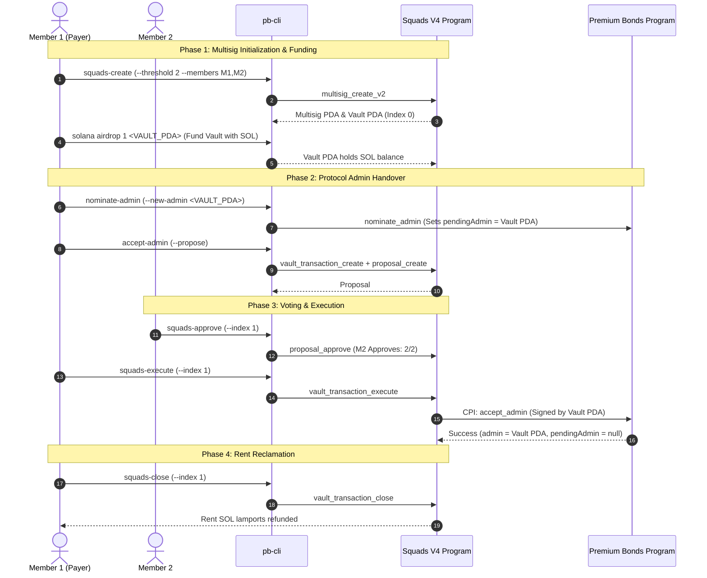

# Complete Educational Runbook: Squads V4 Multisig on Solana Devnet

This educational runbook provides an end-to-end, step-by-step operational guide for initializing, governing, and testing **Squads Protocol V4 Multisig** on Solana Devnet within the **Premium Bonds** protocol.

---

## 1. Architectural Overview & Ecosystem Context

### What is Squads V4?

Squads Protocol V4 is Solana's premier smart contract multisig standard. It enables multi-party governance over treasuries, program upgrade authorities, and critical protocol administrator roles without relying on single private keys.

- **Program ID on Devnet**: [`SQDS4ep65T869zMMBKyuUq6aD6EgTu8psMjkvj52pCf`](https://explorer.solana.com/address/SQDS4ep65T869zMMBKyuUq6aD6EgTu8psMjkvj52pCf?cluster=devnet)
- **Status**: Live, verified, and executable on Devnet.

### Web Interface Status (Why CLI is Required)

> [!IMPORTANT]
> **Decommissioned Devnet Web App**: The Squads team sunset `devnet.squads.so`, and the production web dashboard (`app.squads.so`) connects exclusively to Mainnet-Beta. Consequently, all Devnet multisig interactions (creation, proposing, voting, executing) must be performed programmatically via SDK or terminal CLI (`pb-cli`).

### The Two Critical PDAs: Multisig vs. Vault

```
                       ┌──────────────────────────────────────────────────┐
                       │                   createKey                      │
                       │          (Unique Ephemeral Public Key)           │
                       └────────────────────────┬─────────────────────────┘
                                                │
                                                ▼
                       ┌──────────────────────────────────────────────────┐
                       │               Multisig Account PDA               │
                       │      seeds: ["multisig", "multisig", createKey]   │
                       │  • Tracks members & permissions                  │
                       │  • Tracks threshold & timelock                   │
                       │  • Coordinates proposals & tx sequence counters  │
                       └────────────────────────┬─────────────────────────┘
                                                │
                                                ▼
                       ┌──────────────────────────────────────────────────┐
                       │               Vault PDA (Index 0)                │
                       │ seeds: ["multisig", multisig_pda, "vault", &[0]] │
                       │  • The actual "wallet" address                   │
                       │  • Holds SOL, tokens, and program authorities    │
                       │  • Signs CPIs to Premium Bonds via PDA seeds     │
                       └──────────────────────────────────────────────────┘
```

1. **Multisig PDA**: The coordination hub. It stores the governance configuration: who the members are, the approval threshold (e.g. 2-of-3), timelocks, and transaction indices. **It never signs CPIs directly**.
2. **Vault PDA (Index 0)**: The autonomous executing identity. When a proposal is approved and executed, the Squads program invokes downstream contracts (like Premium Bonds) using the Vault PDA's seeds. **Your protocol admin must always be set to the Vault PDA, not the Multisig PDA**.
   > [!IMPORTANT]
   > **Vault PDA Requires a SOL Balance**: Unlike standard off-curve addresses that act purely as signers, any operational Solana account that pays rent, initializes downstream program accounts, or maintains persistent on-chain identity requires a non-zero SOL (lamport) balance. Always fund the Vault PDA with SOL immediately after creation.

---

## 2. Complete Governance Lifecycle



---

## 3. Step-by-Step Educational Walkthrough

### Step 1: Prepare & Fund Test Keypairs on Devnet

For testing a 2-of-2 multisig, prepare two independent keypairs.

```bash
# 1. Check your default CLI keypair (Member 1)
NO_DNA=1 solana address -u devnet
NO_DNA=1 solana balance -u devnet

# 2. If needed, request Devnet SOL for Member 1
NO_DNA=1 solana airdrop 2 -u devnet

# 3. Create a dedicated keypair for Member 2
mkdir -p ~/.config/solana
NO_DNA=1 solana-keygen new --no-bip39-passphrase --silent --outfile ~/.config/solana/pb-member2-dev.json

# 4. Fund Member 2
NO_DNA=1 solana airdrop 2 $(solana-keygen pubkey ~/.config/solana/pb-member2-dev.json) -u devnet
```

---

### Step 2: Initialize the Devnet Multisig (`squads-create`)

Run `squads-create` specifying both member public keys and a threshold of `2`:

```bash
npm run pb-cli squads-create -- \
  --threshold 2 \
  --members $(solana address -u devnet),$(solana-keygen pubkey ~/.config/solana/pb-member2-dev.json) \
  --rpc https://api.devnet.solana.com
```

#### What this accomplishes on-chain:

1. Generates an ephemeral `createKey` seed.
2. Derives the **Multisig PDA** and **Vault PDA (Index 0)**.
3. Issues a `multisig_create_v2` transaction allocating the multisig account with full initiator, voter, and executor permissions granted to both members.
4. Updates [`scripts/devnet-state/addresses.json`](file:///home/sebastian/vsc-workspace/premium-bonds/scripts/devnet-state/addresses.json) with:
   ```json
   "squadsMultisig": "<MULTISIG_PDA>"
   ```

---

### Step 3: Inspect Initial Multisig State (`squads-status`)

Verify that the multisig was correctly initialized on Devnet:

```bash
npm run -- pb-cli squads-status --rpc https://api.devnet.solana.com
```

**Expected Output Verification**:

- **Threshold**: `2`
- **Members**: Lists both Member 1 and Member 2 public keys with full permissions (`0x7 [Initiate, Vote, Execute]`).
- **Transaction Index**: `0` (no proposals created yet).
- **Default Vault PDA**: Displays the derived Vault address (e.g. `<VAULT_PDA>`).

---

### Step 4: Fund the Multisig Vault PDA with SOL

> [!IMPORTANT]
> **Why the Vault PDA Needs a SOL Balance**:
> Even though transaction fee payers cover network execution gas fees, the **Vault PDA** is an independent on-chain account. When the Vault PDA signs transactions, performs CPIs, or allocates/pays rent for newly initialized protocol accounts, it must hold a positive SOL balance. An unfunded Vault PDA with 0 lamports will cause CPI execution or account initialization to fail.

Fund the derived Vault PDA on Devnet:

```bash
# Option A: Airdrop Devnet SOL directly to the Vault PDA
NO_DNA=1 solana airdrop 1 <VAULT_PDA> -u devnet

# Option B: Transfer SOL from Member 1 to the Vault PDA
NO_DNA=1 solana transfer <VAULT_PDA> 0.5 --allow-unfunded-recipient -u devnet

# Verify Vault PDA SOL balance
NO_DNA=1 solana balance <VAULT_PDA> -u devnet
```

---

### Step 5: Nominate the Multisig Vault as Pending Protocol Admin

In production smart contracts, transferring administrative authority is a sensitive, two-phase process:

1. **Nomination**: Current admin sets `pendingAdmin = <NEW_ADDRESS>`.
2. **Acceptance**: New admin explicitly signs to accept the role.

This prevents irrecoverably locking the protocol if a typo or incorrect address is entered.

Nominate your newly created **Vault PDA** (replace `<VAULT_PDA>` with the Vault address printed in Step 2 / Step 3):

```bash
# 1. Nominate the Vault PDA
npm run pb-cli nominate-admin -- \
  --new-admin <VAULT_PDA> \
  --rpc https://api.devnet.solana.com

# 2. Verify on-chain state
npm run -- pb-cli query-config --rpc https://api.devnet.solana.com
```

The on-chain `GlobalConfig` account will now show:

- `admin`: Current hot deployer key
- `pendingAdmin`: `<VAULT_PDA>`

---

### Step 6: Propose `accept-admin` via Squads Multisig

Because the Vault PDA is an off-curve Program Derived Address, no developer holds a private key to sign transactions for it directly. Instead, the Vault signs via Squads Program invocation (`CPI`).

To execute `accept-admin`, Member 1 submits an admin proposal through `pb-cli`:

```bash
npm run pb-cli accept-admin -- \
  --propose \
  --multisig <MULTISIG_PDA> \
  --rpc https://api.devnet.solana.com
```

#### What happens behind the scenes:

1. `pb-cli` compiles the `accept_admin` instruction with `<VAULT_PDA>` designated as the signer.
2. It sends an atomic transaction containing:
   - `vault_transaction_create`: Stores the instruction bytecode in a new `VaultTransaction` PDA (Transaction Index #1).
   - `proposal_create`: Creates a new `Proposal` PDA tracking votes.
3. Automatically registers Member 1's signature as the first approval (`1 of 2`).

---

### Step 7: Review, Inspect & Vote on the Proposal (Member 2)

Before approving any multisig transaction, members should audit the proposed instruction to ensure no malicious or unintended calls are embedded.

```bash
# 1. List active proposals
npm run -- pb-cli squads-proposals --rpc https://api.devnet.solana.com

# 2. Inspect Proposal #1 inner instruction payload
npm run pb-cli squads-inspect-tx -- \
  --index 1 \
  --rpc https://api.devnet.solana.com
```

Verify that:

- The target program is the Premium Bonds program (`4ZJJemMiVfNzwwoz8BedkWZ8ZKCkx1ya6iA59JS6baGG`).
- Account keys correctly match the protocol's `GlobalConfig` PDA.

Once verified, Member 2 casts their approval:

```bash
npm run pb-cli squads-approve -- \
  --index 1 \
  --keypair ~/.config/solana/pb-member2-dev.json \
  --rpc https://api.devnet.solana.com
```

Re-check status:

```bash
npm run pb-cli squads-proposals --rpc https://api.devnet.solana.com
```

Status now displays: **`Approved (2/2)`**!

---

### Step 8: Execute the Proposal

Now that the threshold is met, any member can trigger execution on Devnet:

```bash
npm run pb-cli squads-execute -- \
  --index 1 \
  --rpc https://api.devnet.solana.com
```

#### What happens on-chain:

- The Squads V4 program executes `vault_transaction_execute`.
- It derives the Vault PDA seeds and issues a Cross-Program Invocation (`CPI`) into Premium Bonds' `accept_admin` instruction.
- Premium Bonds validates that the caller is the exact `pendingAdmin`, updates `admin = <VAULT_PDA>`, and clears `pendingAdmin = null`.

Verify the handover:

```bash
npm run pb-cli query-config --rpc https://api.devnet.solana.com
```

You will observe that `admin` is now officially the **Squads Vault PDA**!

---

### Step 9: Update Local Devnet State & Test Ongoing Governance

Update [`scripts/devnet-state/addresses.json`](file:///home/sebastian/vsc-workspace/premium-bonds/scripts/devnet-state/addresses.json):

```json
{
  "adminAddress": "<VAULT_PDA>",
  "squadsMultisig": "<MULTISIG_PDA>"
}
```

Now, all sensitive admin operations require multisig authorization. Try pausing or unpausing a pool in `--propose` mode:

```bash
# Propose unpausing a pool via multisig
npm run pb-cli unpause-pool -- \
  --pool <POOL_PUBKEY> \
  --propose \
  --confirm \
  --rpc https://api.devnet.solana.com
```

This generates **Proposal #2**. You can repeat the `squads-inspect-tx` $\rightarrow$ `squads-approve` $\rightarrow$ `squads-execute` cycle for ongoing protocol maintenance.

---

### Step 10: Reclaim Rent Lamports (`squads-close`)

Each proposal and transaction account locks ~0.002 to ~0.005 SOL in rent exemption. Once a proposal has been executed or cancelled, you can permanently close the accounts and recover the lamports:

```bash
npm run pb-cli squads-close -- \
  --index 1 \
  --rpc https://api.devnet.solana.com
```

The rent lamports are refunded directly to the fee payer.

---

## 4. Troubleshooting & Operational Tips

| Issue / Symptom                                     | Root Cause                                                                                               | Solution                                                                                                        |
| :-------------------------------------------------- | :------------------------------------------------------------------------------------------------------- | :-------------------------------------------------------------------------------------------------------------- |
| `Vault PDA has 0 SOL / Insufficient funds for rent` | The Squads Vault PDA was never funded with SOL after creation. CPIs or account funding require lamports. | Airdrop or transfer SOL to the Vault PDA (`solana airdrop 1 <VAULT_PDA> -u devnet`).                            |
| `Proposal has stale index`                          | An earlier proposal modified the multisig members or settings, invalidating previous sequence numbers.   | Close stale proposals using `squads-close` and re-propose with current index.                                   |
| `Cannot execute Proposal: Timelock has not expired` | A non-zero `timeLock` was specified during multisig creation.                                            | Wait until the timelock window passes before calling `squads-execute`. For Devnet testing, keep `--timelock 0`. |
| `Signer is not an authorized member`                | The transaction fee payer or signing keypair is not registered in the multisig's member list.            | Check member keys with `squads-status` and pass `--keypair <PATH>` matching a registered member.                |
| `429 Too Many Requests` on RPC                      | Solana public devnet RPC rate limits during batch polling.                                               | Use a dedicated Devnet RPC endpoint (e.g. Helius, Triton, QuickNode) via `--rpc <URL>`.                         |
