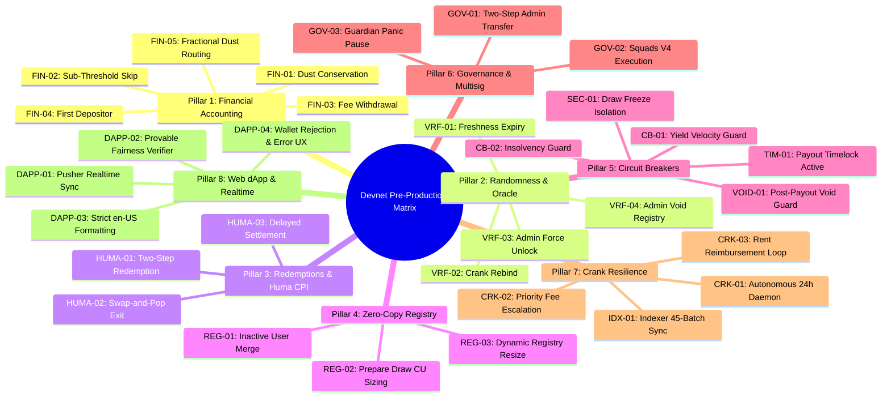

# Comprehensive Pre-Production Devnet Test Matrix

This document defines the exhaustive, audit-grade verification matrix of all critical tests that must be executed on Solana Devnet before deploying the Premium Bonds protocol and dApp to Mainnet-Beta.

---

## Pre-Production Test Matrix Structure

The verification suite is organized into **8 testing pillars** comprising **26 distinct test scenarios**:

---

### Pillar 1: Financial Accounting & Invariant Conservation

| Test ID      | Test Scenario                             | Preconditions                                                                              | Execution Command / Procedure                                                  | Expected Outcome & Invariants                                                                                                                                                                                 |
| ------------ | ----------------------------------------- | ------------------------------------------------------------------------------------------ | ------------------------------------------------------------------------------ | ------------------------------------------------------------------------------------------------------------------------------------------------------------------------------------------------------------- |
| **`FIN-01`** | **Dust Conservation on Non-Round Pot**    | Active pool with odd simulated yield (e.g. 33.333333 USDC) and 180 winners across 4 tiers. | `npm run devnet test-180 -- --yield 33.333333`                                 | Fractional dust ($33,333,333 - \sum \text{payouts}$) is subtracted from `total_prizes_allocated` and refunded to pool liabilities. Invariant: $\text{total\_distributed} + \text{dust} == \text{prize\_pot}$. |
| **`FIN-02`** | **Zero-Yield / Sub-Threshold Skip**       | Pool configured with `min_yield_threshold = 10 USDC`.                                      | Trigger `npm run pb-cli harvest -- --pool 1` with 0 simulated yield.           | Pool emits `DrawSkipped(InsufficientYield)`, cycle ID increments by 1, and pool freeze is avoided. Deposits and withdrawals continue uninterrupted.                                                           |
| **`FIN-03`** | **Fee Withdrawal Accounting**             | `pool.total_fees_accrued > total_fees_withdrawn`.                                          | `npm run pb-cli withdraw-fees -- --pool 1 --amount all --confirm`              | Exact accrued fee transferred to `fee_wallet`. `total_fees_withdrawn` incremented. Subsequent withdrawal of $> 0$ rejected with `InsufficientFeesForWithdrawal` (`6016`).                                     |
| **`FIN-04`** | **First Depositor & Rounding Protection** | Freshly initialized pool with 0 existing tickets.                                          | User deposits 1 USDC (1 bond) via web dApp or CLI.                             | User assigned ticket indices $[0, 0]$ ($1$ active ticket), `cumulative_active = 1`, and zero dilution or share loss occurs.                                                                                   |
| **`FIN-05`** | **Reinvestment Fractional Dust Routing**  | Winner prize $< 1$ bond (e.g. 0.25 USDC in Tier 4).                                        | Execute `npm run devnet test-180` (Tier 4 winners receive 250,000 micro-USDC). | 0 bonds purchased; exact 250,000 micro-USDC credited to `user_winnings.unclaimed_non_reinvested_winnings`. User can claim via `claim_non_reinvested_winnings`.                                                |

---

### Pillar 2: Randomness & Oracle Failure Modes

| Test ID      | Test Scenario                              | Preconditions                                                                               | Execution Command / Procedure                                                                                   | Expected Outcome & Invariants                                                                                    |
| ------------ | ------------------------------------------ | ------------------------------------------------------------------------------------------- | --------------------------------------------------------------------------------------------------------------- | ---------------------------------------------------------------------------------------------------------------- |
| **`VRF-01`** | **Freshness Window Expiry (> 1000 slots)** | Draw committed with Switchboard randomness, but reveal delayed $> 1000$ slots.              | Delay reveal submission past 1000 slots and attempt `reveal_and_pick_winners`.                                  | Transaction rejected on-chain with `StaleRandomnessRequest` (`6031`). Pool remains safely frozen pending rebind. |
| **`VRF-02`** | **Crank Rebind Expired Randomness**        | Draw cycle expired ($> 1000$ slots since commitment).                                       | `npm run pb-cli rebind-randomness -- --pool 1 --new-randomness <NEW_SB_ACCOUNT>`                                | Draw cycle rebound to fresh Switchboard account; `vrf_seed_slot` updated; pool unblocks for reveal.              |
| **`VRF-03`** | **Admin Emergency Force Unlock**           | Oracle permanently offline or unresolvable.                                                 | `npm run pb-cli force-unlock-draw -- --pool 1 --confirm`                                                        | Draw cycle aborted, `pool.is_frozen_for_draw` reset to 0, deposited principal fully preserved.                   |
| **`VRF-04`** | **Admin Emergency Void Payout Registry**   | Draw revealed, but error discovered prior to processing payouts (`payouts_completed == 0`). | `npm run pb-cli void-draw -- --pool 1 --confirm` followed by `npm run pb-cli close-payout-registry -- --pool 1` | `PayoutRegistry.is_voided = 1`; all reinvestments blocked; PDA closed and rent fully reclaimed immediately.      |

---

### Pillar 3: Two-Step Principal Redemptions & Huma DeFi CPI Integration

| Test ID       | Test Scenario                          | Preconditions                                                                                | Execution Command / Procedure                                                                                                | Expected Outcome & Invariants                                                                                                                           |
| ------------- | -------------------------------------- | -------------------------------------------------------------------------------------------- | ---------------------------------------------------------------------------------------------------------------------------- | ------------------------------------------------------------------------------------------------------------------------------------------------------- |
| **`HUMA-01`** | **Two-Step Redemption Flow**           | User holds $\ge 50$ active bonds.                                                            | 1. User submits `sell_bonds(50)`. 2. Crank / Mock Huma executes `settle_requests`. 3. User submits `claim_redemption`. | Bonds burned from registry; Huma redemption request queued; USDC settled to pool PST vault; user claims 50.00 USDC into wallet ATA.                     |
| **`HUMA-02`** | **Registry Swap-and-Pop on Full Exit** | User sells 100% of their bonds.                                                              | User calls `sell_bonds(all)`.                                                                                                | Last entry in zero-copy `TicketRegistry` swapped into vacated user index. `swapped_user_winnings` reindexed correctly. Registry length decrements by 1. |
| **`HUMA-03`** | **Delayed Huma Settlement Guard**      | User sells bonds, but Huma redemption has not yet settled (`request_id >= next_request_id`). | User attempts `claim_redemption` immediately.                                                                                | Transaction rejected with `RedemptionNotReady` (`6042`). Funds remain safe in escrow until settlement.                                                  |

---

### Pillar 4: Zero-Copy Ticket Registry Scaling & Lazy Merging

| Test ID      | Test Scenario                          | Preconditions                                                | Execution Command / Procedure                               | Expected Outcome & Invariants                                                                                                                                 |
| ------------ | -------------------------------------- | ------------------------------------------------------------ | ----------------------------------------------------------- | ------------------------------------------------------------------------------------------------------------------------------------------------------------- |
| **`REG-01`** | **Multi-Cycle Inactive User Merge**    | User deposits in Cycle 1, stays inactive through Cycles 2–8. | User deposits or wins in Cycle 9.                           | Registry lazy-merges entry: pending tickets from Cycle 1 convert to active, `merged_draw_cycle_id` updates to 9, and ticket sums remain mathematically exact. |
| **`REG-02`** | **Batched Draw Preparation CU Sizing** | Large user registry ($> 100$ users).                         | `npm run pb-cli prepare-draw -- --pool 1 --batch-size 1000` | Merges pending tickets and computes prefix sums in batches; each transaction consumes $< 200,000$ CU.                                                         |
| **`REG-03`** | **Dynamic Registry Resize**            | Admin reallocates account space for expanding user capacity. | `npm run pb-cli resize-registry -- --pool 1`                | Zero-copy `TicketRegistry` account reallocated by 10 KiB increments without zeroing or corrupting existing user entries.                                      |

---

### Pillar 5: Circuit Breakers & State Isolation Guards

| Test ID       | Test Scenario                                  | Preconditions                                                                  | Execution Command / Procedure                                                  | Expected Outcome & Invariants                                                                                                                 |
| ------------- | ---------------------------------------------- | ------------------------------------------------------------------------------ | ------------------------------------------------------------------------------ | --------------------------------------------------------------------------------------------------------------------------------------------- |
| **`CB-01`**   | **Yield Velocity Spike Guard Trip & Recovery** | Pool configured with `max_yield_basis_points = 500` (5%).                      | Simulate yield $> 5\%$ of book value and trigger harvest.                      | Contract halts draw with `HaltedYieldSpike`, emits `YieldVelocityBreached`, and pauses pool. Admin calls `unpause-pool --confirm` to recover. |
| **`CB-02`**   | **Emergency Insolvency Deficit Guard**         | Mock Huma pool injects negative yield ($current\_value < book\_value - dust$). | Trigger harvest on insolvent pool.                                             | Contract halts draw with `HaltedInsolvent`, emits `EmergencyInsolvencyDetected`, pauses pool, and protects remaining principal.               |
| **`SEC-01`**  | **Draw Freeze State Isolation**                | Draw cycle in `AwaitingRandomness` (`is_frozen_for_draw == 1`).                | Attempt `buy_bonds`, `sell_bonds`, `set_prize_tiers`, or `update_pool_config`. | All mutating transactions rejected on-chain with `AwaitingRandomnessFreeze` (`6006`).                                                         |
| **`TIM-01`**  | **Payout Timelock Active Enforcement**         | Pool configured with `payout_timelock_seconds = 300`.                          | Reveal draw and attempt `reinvest_winnings` before 300s elapses.               | Transaction rejected with `PayoutTimelockActive` (`6041`). Reinvest succeeds once 300s clock expires.                                         |
| **`VOID-01`** | **Post-Payout Emergency Void Guard**           | At least 1 winner reinvestment confirmed (`payouts_completed > 0`).            | Admin attempts `admin_void_payout_registry`.                                   | Transaction rejected on-chain with `PayoutsAlreadyStarted` (`6038`).                                                                          |

---

### Pillar 6: Governance & Multisig Operations (Squads V4)

| Test ID      | Test Scenario                             | Preconditions                                      | Execution Command / Procedure                                                                                                                          | Expected Outcome & Invariants                                                                                        |
| ------------ | ----------------------------------------- | -------------------------------------------------- | ------------------------------------------------------------------------------------------------------------------------------------------------------ | -------------------------------------------------------------------------------------------------------------------- |
| **`GOV-01`** | **Two-Step Admin Transfer**               | Active admin wallet.                               | 1. `npm run pb-cli nominate-admin -- --new-admin <NEW_ADDR>` 2. `npm run pb-cli accept-admin -- --keypair <NEW_KEY>`                                | Old admin remains in power during pending state; candidate signs to accept; `GlobalConfig.admin` transferred safely. |
| **`GOV-02`** | **Squads V4 Multisig Proposal Execution** | Squads V4 multisig vault configured as pool admin. | 1. `npm run pb-cli update-pool-config -- --pool 1 --fee-bps 150 --propose` 2. Members vote via `squads-approve` 3. Execute via `squads-execute`. | Proposal created, approved (2-of-3 threshold), and executed against target program with timelock verification.       |
| **`GOV-03`** | **Guardian Emergency Panic Button**       | Designated guardian keypair.                       | `npm run pb-cli pause-pool -- --pool 1 --keypair guardian.json`                                                                                        | Pool instantly paused (deposits and redemptions blocked). Only cold `admin` authority can call `unpause-pool`.       |

---

### Pillar 7: Crank Service Liveness & Resilience

| Test ID      | Test Scenario                           | Preconditions                                        | Execution Command / Procedure                                        | Expected Outcome & Invariants                                                                                                                           |
| ------------ | --------------------------------------- | ---------------------------------------------------- | -------------------------------------------------------------------- | ------------------------------------------------------------------------------------------------------------------------------------------------------- |
| **`CRK-01`** | **Autonomous 24-Hour Cycle Execution**  | Crank daemon configured with funded keypair.         | `npm run devnet:crank` running continuously.                         | Crank autonomously triggers harvest, prepare draw, VRF reveal, batched winner reinvestment, and payout registry closure across consecutive cycles.      |
| **`CRK-02`** | **Priority Fee Escalation & Retries**   | Public Devnet RPC congestion or dropped packets.     | Crank encounters expired blockhash during batch reinvestment.        | Crank refreshes blockhashes, applies 25,000 micro-lamport compute unit price, retries with exponential backoff, and confirms batches.                   |
| **`CRK-03`** | **100% Crank Rent Reimbursement Loop**  | Track crank wallet SOL balance over multiple cycles. | Execute full draw cycle and close registry.                          | Crank SOL balance post-close matches pre-harvest balance minus minimal transaction fees ($\Delta SOL \approx -\text{tx\_fees}$, rent fully reimbursed). |
| **`IDX-01`** | **Indexer 45-Batch Concurrency Stress** | Indexer daemon running against Neon Postgres.        | Run `npm run devnet:test-180` and monitor `scripts/indexer-sync.ts`. | All 180 winner records, winning ticket indices, and the `PayoutRegistryClosed` event are indexed with 0 dropped events.                                 |

---

### Pillar 8: Web dApp User Experience & Realtime Sync

| Test ID       | Test Scenario                          | Preconditions                                                 | Execution Command / Procedure                                             | Expected Outcome & Invariants                                                                                    |
| ------------- | -------------------------------------- | ------------------------------------------------------------- | ------------------------------------------------------------------------- | ---------------------------------------------------------------------------------------------------------------- |
| **`DAPP-01`** | **Pusher Realtime Event Ingestion**    | Web dApp open on `/dashboard`.                                | Execute `buy_bonds` or draw reveal in CLI.                                | Dashboard balances, active tickets, and draw history update in realtime without browser refresh.                 |
| **`DAPP-02`** | **Provable Fairness Verifier Dialog**  | Completed draw with Switchboard VRF seed.                     | Navigate to `/dashboard/draws`, open draw modal, click "Verify Fairness". | Client-side PRNG re-run matches on-chain winning ticket indices 100% with green verification badge.              |
| **`DAPP-03`** | **Strict "en-US" Number Formatting**   | Switch language selector to `es` (Spanish) or `zh` (Chinese). | Inspect pool cards, deposit modal, and prize tiers.                       | All currency and decimal numbers remain formatted with period decimal (`.`) and comma thousands separator (`,`). |
| **`DAPP-04`** | **Wallet-Standard Rejection Handling** | Connect Phantom or Solflare wallet.                           | Reject a deposit transaction in wallet extension (Error 4001).            | Modal displays friendly user-rejection banner without crashing or showing unhandled red error overlays.          |

---

## Pre-Production Sign-Off Checklist

Before mainnet deployment, the deployment team must confirm:

- [ ] All 26 Pre-Production Test Vectors executed and passed on Devnet.
- [ ] Turnkey 180-winner test (`npm run devnet:test-180`) executed with 45 confirmed reinvestment transactions and clean rent reclamation.
- [ ] Multi-user seeding test (`npm run devnet:test-180:seed`) verified with multi-wallet winner distribution.
- [ ] All 20 LiteSVM unit tests passed (`cd anchor && NO_DNA=1 cargo test --test test_dynamic_payout_registry`).
- [ ] TypeScript test suite passed (`npm run test`).
- [ ] ESLint and Prettier checks passed (`npm run lint && npm run format:check`).
