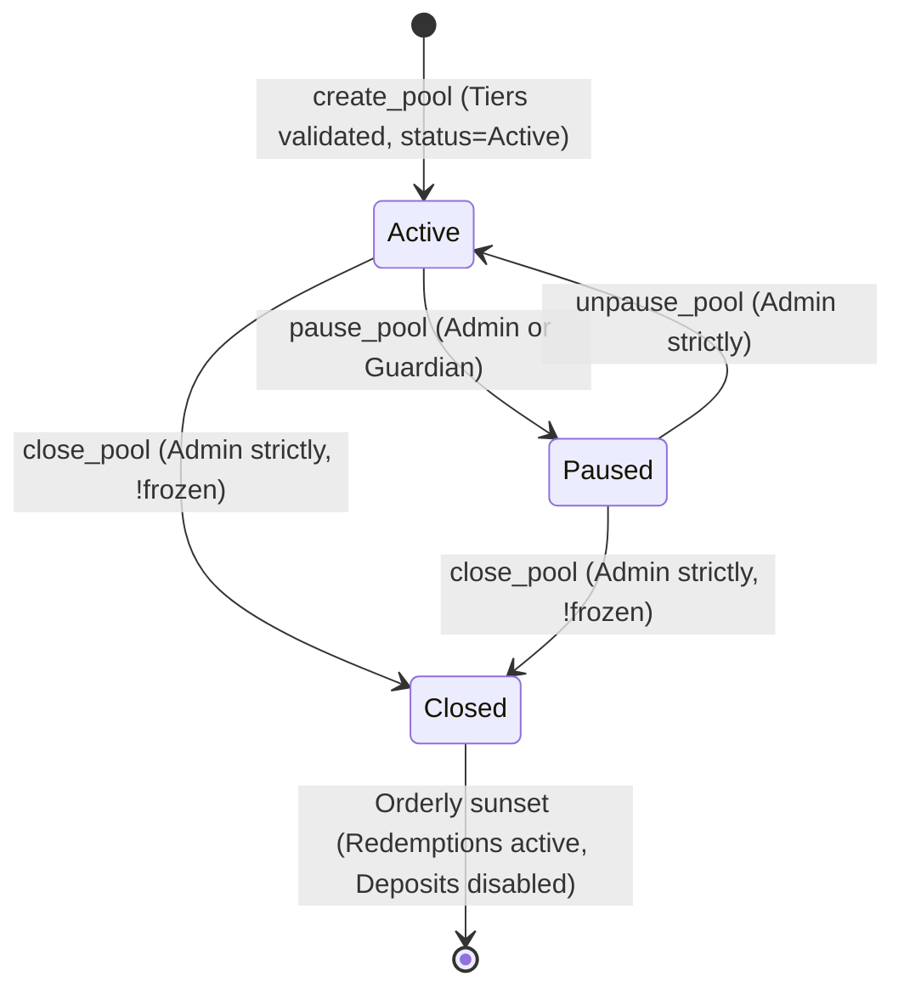
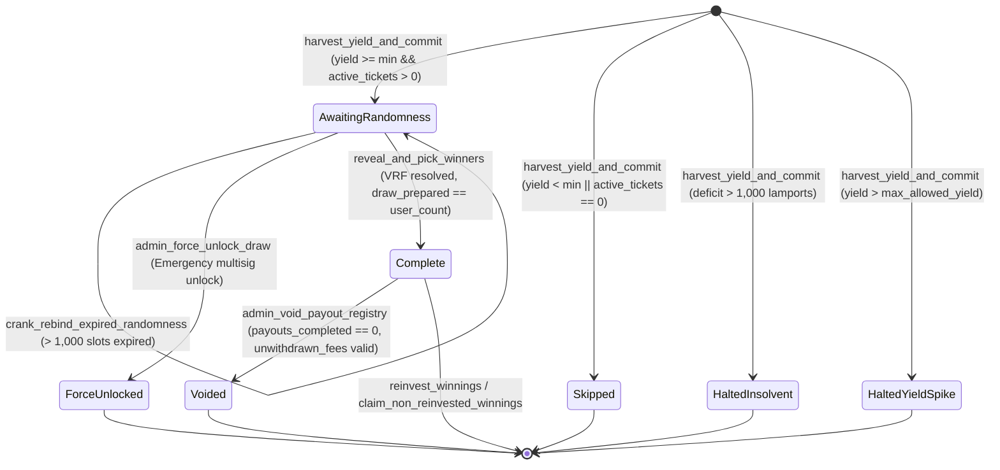

# Formal Invariant Specification: YieldBonds Protocol

**Domain Context:** [README.md](file:///home/sebastian/vsc-workspace/premium-bonds/README.md), [ticket-registry-redesign.md](file:///home/sebastian/vsc-workspace/premium-bonds/ticket-registry-redesign.md), [docs/agents/domain.md](file:///home/sebastian/vsc-workspace/premium-bonds/docs/agents/domain.md)  
**Extracted At:** 2026-08-27  
**Audit Mode:** `reconciliation` (Mode 3 Formal Spec-Code Reconciliation & Drift Verification)  
**Overall Conformance:** 22/22 Instructions Verified | 8 Conservation Laws Verified | 8 Metamorphic Relations Verified | 51 Error Codes Mapped (100% Conformance)

---

## 1. Global System Invariants & Conservation Laws

These algebraic invariants and conservation laws must ALWAYS hold across all instruction executions in the YieldBonds protocol.

### `INV-SOLV-001`: Dual-Asset Protocol Solvency & Valuation Parity

- **Domain:** Solvency & Vault Accounting
- **Vector Tag:** `Math`
- **Provenance:** `code_mined`
- **Code Conformance:** `VERIFIED`
- **Source Location:** [`harvest_yield_and_commit.rs#L177-L236`](file:///home/sebastian/vsc-workspace/premium-bonds/anchor/programs/anchor/src/instructions/yield_draw/harvest_yield_and_commit.rs#L177-L236)
- **Conservation Law:**
  $$\text{CurrentValue} = \left\lfloor \frac{\text{pool\_pst\_balance} \times \text{huma\_total\_assets}}{\text{pst\_supply}} \right\rfloor$$
  $$\text{BookValue} = \text{total\_deposited\_principal} + (\text{total\_fees\_accrued} - \text{total\_fees\_withdrawn}) + \text{total\_prizes\_allocated}$$
  $$\text{BookValue} - \text{CurrentValue} \le \text{SOLVENCY\_DUST\_TOLERANCE} \quad (1,000 \text{ base units})$$
- **Description:** Protocol assets (yield-bearing $PST shares converted to USDC via on-chain Huma pool asset ratio) must always match or exceed outstanding protocol liabilities (active user principal, unwithdrawn accrued protocol fees, and allocated prize pots). If the deficit exceeds the 1,000 base unit dust tolerance, the on-chain circuit breaker immediately trips, halts the pool, and transitions the draw cycle to `DrawStatus::HaltedInsolvent`.

### `INV-SOLV-002`: Ticket Registry Mass Conservation

- **Domain:** Ticket Registry Accounting
- **Vector Tag:** `Math`
- **Provenance:** `code_mined`
- **Code Conformance:** `VERIFIED`
- **Source Location:** [`registry.rs#L19-L22`](file:///home/sebastian/vsc-workspace/premium-bonds/anchor/programs/anchor/src/state/registry.rs#L19-L22), [`buy_bonds.rs#L246-L250`](file:///home/sebastian/vsc-workspace/premium-bonds/anchor/programs/anchor/src/instructions/user/buy_bonds.rs#L246-L250), [`sell_bonds.rs#L276-L283`](file:///home/sebastian/vsc-workspace/premium-bonds/anchor/programs/anchor/src/instructions/user/sell_bonds.rs#L276-L283)
- **Conservation Law:**
  $$\text{TicketRegistry.total\_active\_tickets} + \text{TicketRegistry.total\_pending\_tickets} = \sum_{i=0}^{\text{user\_count}-1} (\text{UserEntry}[i].\text{active} + \text{UserEntry}[i].\text{pending})$$
- **Description:** The global ticket counters stored in the `TicketRegistry` zero-copy header must strictly equal the sum of all individual active and pending tickets across all valid user slots $[0, \text{user\_count}-1]$.

### `INV-SOLV-003`: User Index Bijective PDA Mapping & Swap-and-Pop Invariant

- **Domain:** User Registry State & Memory Integrity
- **Vector Tag:** `Access` / `Realloc`
- **Provenance:** `code_mined`
- **Code Conformance:** `VERIFIED`
- **Source Location:** [`sell_bonds.rs#L250-L312`](file:///home/sebastian/vsc-workspace/premium-bonds/anchor/programs/anchor/src/instructions/user/sell_bonds.rs#L250-L312), [`pool.rs#L405-L422`](file:///home/sebastian/vsc-workspace/premium-bonds/anchor/programs/anchor/src/state/pool.rs#L405-L422)
- **Conservation Law:**
  $$\forall i \in [0, \text{user\_count}-1], \quad \text{UserWinnings}(\text{UserEntry}[i].\text{owner}).\text{registry\_entry\_index} = i$$
  $$\forall \text{user} \text{ with 0 tickets}, \quad \text{UserWinnings}(\text{user}).\text{registry\_entry\_index} = \text{u32::MAX} \quad (\text{UNASSIGNED\_ENTRY\_INDEX})$$
- **Description:** Every active entry at index $i$ in `TicketRegistry` corresponds bijectively to a `UserWinnings` PDA where `registry_entry_index == i`. When an exiting user at slot $k < N-1$ sells all tickets, the last entry at $N-1$ is relocated into slot $k$, `swapped_user_winnings.registry_entry_index` is updated to $k$, and the vacated memory slot at $N-1$ is explicitly cleared with zeroed default memory (`UserEntry::default()`).

### `INV-SOLV-004`: Pending Redemption Asset Backing

- **Domain:** Async Redemption Accounting
- **Vector Tag:** `Math`
- **Provenance:** `code_mined`
- **Code Conformance:** `VERIFIED`
- **Source Location:** [`pool.rs#L91`](file:///home/sebastian/vsc-workspace/premium-bonds/anchor/programs/anchor/src/state/pool.rs#L91), [`sell_bonds.rs#L328-L332`](file:///home/sebastian/vsc-workspace/premium-bonds/anchor/programs/anchor/src/instructions/user/sell_bonds.rs#L328-L332), [`claim_redemption.rs#L212-L217`](file:///home/sebastian/vsc-workspace/premium-bonds/anchor/programs/anchor/src/instructions/user/claim_redemption.rs#L212-L217)
- **Conservation Law:**
  $$\text{PrizePool.total\_pending\_redemptions} = \sum_{r \in \text{ActivePendingRedemptions}} \text{PendingRedemption}[r].\text{amount}$$
- **Description:** The aggregate `total_pending_redemptions` counter tracked on `PrizePool` strictly equals the sum of all active, unsettled `PendingRedemption` PDA amounts across bond sales, prize claims, and fee withdrawals.

### `INV-SOLV-005`: Prize Tier Share Conservation & Winner Allocation

- **Domain:** Prize Pool Configuration
- **Vector Tag:** `Math`
- **Provenance:** `code_mined`
- **Code Conformance:** `VERIFIED`
- **Source Location:** [`pool.rs#L295-L334`](file:///home/sebastian/vsc-workspace/premium-bonds/anchor/programs/anchor/src/state/pool.rs#L295-L334)
- **Conservation Law:**
  $$\sum_{t=0}^{\text{prize\_tiers\_count}-1} (\text{PrizeTier}[t].\text{basis\_points} \times \text{PrizeTier}[t].\text{num\_winners}) = 10,000 \quad (100.00\%)$$
  $$\sum_{t=0}^{\text{prize\_tiers\_count}-1} \text{PrizeTier}[t].\text{num\_winners} \le \text{MAX\_TOTAL\_WINNERS} \quad (50)$$
- **Description:** The sum of basis points multiplied by the number of winners across all active prize tiers must equal exactly 10,000 (100.00%). Each tier must specify `basis_points > 0` and `num_winners > 0`, with total winners capped at 50.

### `INV-SOLV-006`: Ticket-to-Principal Capital Invariant

- **Domain:** Financial Accounting
- **Vector Tag:** `Math` / `Boundary`
- **Provenance:** `code_mined`
- **Code Conformance:** `VERIFIED`
- **Source Location:** [`update_pool_config.rs#L94-L101`](file:///home/sebastian/vsc-workspace/premium-bonds/anchor/programs/anchor/src/instructions/admin/update_pool_config.rs#L94-L101)
- **Conservation Law:**
  $$(\text{TicketRegistry.total\_active\_tickets} + \text{TicketRegistry.total\_pending\_tickets}) \times \text{PrizePool.bond\_price} = \text{PrizePool.total\_deposited\_principal}$$
- **Description:** Total active and pending ticket mass multiplied by `bond_price` strictly equals `total_deposited_principal`. Changing `bond_price` while active deposits (`total_deposited_principal > 0`), pending redemptions (`total_pending_redemptions > 0`), or allocated prizes (`total_prizes_allocated > 0`) exist is strictly blocked (`CannotModifyBondPriceWithActiveDeposits`).

### `INV-SOLV-007`: Reinvestment Principal & Dust Conservation

- **Domain:** Prize Payouts & Dust Accounting
- **Vector Tag:** `Math`
- **Provenance:** `code_mined`
- **Code Conformance:** `VERIFIED`
- **Source Location:** [`reinvest_winnings.rs#L147-L188`](file:///home/sebastian/vsc-workspace/premium-bonds/anchor/programs/anchor/src/instructions/yield_draw/reinvest_winnings.rs#L147-L188)
- **Conservation Law:**
  $$\text{TotalAvailable} = \text{Winner.amount\_owed} + \text{UserWinnings.unclaimed\_non\_reinvested\_winnings}_{\text{before}}$$
  $$\text{BondsBought} = \lfloor \text{TotalAvailable} / \text{bond\_price} \rfloor$$
  $$\text{ReinvestedPrincipal} = \text{BondsBought} \times \text{bond\_price}$$
  $$\text{UserWinnings.unclaimed\_non\_reinvested\_winnings}_{\text{after}} = \text{TotalAvailable} - \text{ReinvestedPrincipal}$$
- **Description:** Winnings reinvestment converts exact integer multiples of `bond_price` into new principal and active tickets. Fractional remainder dust is preserved in `unclaimed_non_reinvested_winnings` for later cash-out or aggregation with future prizes.

### `INV-SOLV-008`: Yield Harvest Net Pot & Protocol Fee Partition Conservation

- **Domain:** Yield Draw / Treasury Accounting
- **Vector Tag:** `Math`
- **Provenance:** `code_mined`
- **Code Conformance:** `VERIFIED`
- **Source Location:** [`harvest_yield_and_commit.rs#L275-L300`](file:///home/sebastian/vsc-workspace/premium-bonds/anchor/programs/anchor/src/instructions/yield_draw/harvest_yield_and_commit.rs#L275-L300), [`utils.rs#L14-L22`](file:///home/sebastian/vsc-workspace/premium-bonds/anchor/programs/anchor/src/utils.rs#L14-L22)
- **Conservation Law:**
  $$\text{ProtocolFee} = \lfloor \text{YieldGenerated} \times \text{fee\_basis\_points} / 10,000 \rfloor$$
  $$\text{PrizePot} = \text{YieldGenerated} - \text{ProtocolFee}$$
  $$\text{PrizePot} + \text{ProtocolFee} = \text{YieldGenerated}$$
- **Description:** Harvested yield is partitioned strictly into the protocol fee and net prize pot via integer arithmetic without rounding deficit.

---

## 2. State Account Architecture (7 Accounts & Vaults)

| Account Name | Size (Bytes) | Discriminator / Space Formula | Canonical PDA Seeds | Struct Alignment |
| :--- | :---: | :--- | :--- | :---: |
| [`GlobalConfig`](file:///home/sebastian/vsc-workspace/premium-bonds/anchor/programs/anchor/src/state/global_state.rs#L12-L23) | `169` | `8 + 32 + 32 + 32 + 1 + 64` | `[b"global_config"]` | 8-byte aligned |
| [`PrizePool`](file:///home/sebastian/vsc-workspace/premium-bonds/anchor/programs/anchor/src/state/pool.rs#L70-L131) | `424` | `8 + 416` (zero-copy `unsafe`) | `[b"prize_pool", pool_id.to_le_bytes()]` | 8-byte aligned |
| [`TicketRegistry`](file:///home/sebastian/vsc-workspace/premium-bonds/anchor/programs/anchor/src/state/registry.rs#L11-L33) | `262,248` to `10,485,760` | `104` B Header + $N \times 64$ B [`UserEntry`](file:///home/sebastian/vsc-workspace/premium-bonds/anchor/programs/anchor/src/state/registry.rs#L85-L104) | `[b"ticket_registry", pool_id.to_le_bytes()]` (or direct key) | 8-byte aligned |
| [`UserWinnings`](file:///home/sebastian/vsc-workspace/premium-bonds/anchor/programs/anchor/src/state/pool.rs#L380-L400) | `138` | `8 + 8 + 8 + 8 + 4 + 4 + 32 + 1 + 1 + 64` | `[b"user_winnings", pool_id.to_le_bytes(), user.as_ref()]` | 8-byte aligned |
| [`DrawCycle`](file:///home/sebastian/vsc-workspace/premium-bonds/anchor/programs/anchor/src/state/draw.rs#L38-L66) | `187` | `8 + 8 + 8 + 8 + 8 + 8 + 32 + 4 + 4 + 4 + 2 + 1 + 32 + 64` | `[b"draw_cycle", pool_id.to_le_bytes(), cycle_id.to_le_bytes()]` | 8-byte aligned |
| [`PayoutRegistry`](file:///home/sebastian/vsc-workspace/premium-bonds/anchor/programs/anchor/src/state/draw.rs#L90-L112) | `2,904` | `8 + 2896` (zero-copy `unsafe`, 50 $\times$ 56 B [`Winner`](file:///home/sebastian/vsc-workspace/premium-bonds/anchor/programs/anchor/src/state/draw.rs#L177-L195)) | `[b"payout", pool_id.to_le_bytes(), cycle_id.to_le_bytes()]` | 8-byte aligned |
| [`PendingRedemption`](file:///home/sebastian/vsc-workspace/premium-bonds/anchor/programs/anchor/src/state/pending_redemption.rs#L23-L47) | `159` | `8 + 16 + 8 + 8 + 8 + 8 + 32 + 4 + 1 + 1 + 1 + 64` | `[b"pending_redemption", pool_id.to_le_bytes(), redemption_id.to_le_bytes()]` | 8-byte aligned |
| `PoolVaultAccount` (USDC) | SPL Token | Interface Token Account | `[b"pool_vault", pool_id.to_le_bytes()]` | Token PDA |
| `PoolPstVault` ($PST) | SPL Token | Interface Token Account | `[b"pool_pst", pool_id.to_le_bytes()]` | Token PDA |
| `EventAuthority` | System PDA | Event Authority Account | `[b"__event_authority"]` | Canonical CPI |

---

## 3. Dual Finite State Machine (FSM) Lifecycle Models

### 3.1 Pool Administrative Lifecycle FSM

| Source Status | Trigger Instruction | Caller Role | Target Status | Transition Guards & Constraints |
| :--- | :--- | :--- | :--- | :--- |
| `[*]` | `create_pool` | Admin | `Active` | Parameters valid, prize tiers sum to 10,000 bps (`BasisPointsMustEqual10000`) |
| `Active` | `pause_pool` | Admin or Guardian | `Paused` | Pool status $\neq$ `Closed` (`PoolClosed`) |
| `Paused` | `unpause_pool` | Admin strictly | `Active` | Pool status $==$ `Paused` (`PoolNotActive`), signer $==$ `admin` (`UnauthorizedAdmin`) |
| `Active` / `Paused` | `close_pool` | Admin strictly | `Closed` | Pool status $\neq$ `Closed` (`PoolClosed`), `is_frozen_for_draw == 0` (`AwaitingRandomnessFreeze`) |

### 3.2 Draw Cycle Pipeline & Circuit Breakers FSM

| Source State | Trigger Instruction | Caller Role | Target State | Guards & Error Enforcements |
| :--- | :--- | :--- | :--- | :--- |
| `Draft` / `[*]` | `harvest_yield_and_commit` | Crank (`jobs_account`) | `AwaitingRandomness` | `unix_timestamp >= cycle_end`, `yield >= min_threshold`, `tickets > 0`, `is_frozen == 0` |
| `Draft` / `[*]` | `harvest_yield_and_commit` | Crank (`jobs_account`) | `Skipped` | `yield < min_threshold` or `active_tickets == 0`, rolls over yield, emits `DrawSkipped` |
| `Draft` / `[*]` | `harvest_yield_and_commit` | Crank (`jobs_account`) | `HaltedInsolvent` | Venue deficit $> 1,000$ base units, pauses pool, emits `EmergencyInsolvencyDetected` |
| `Draft` / `[*]` | `harvest_yield_and_commit` | Crank (`jobs_account`) | `HaltedYieldSpike` | Single-cycle yield rate $> \text{max\_yield\_basis\_points}$, pauses pool, emits `YieldVelocityBreached` |
| `AwaitingRandomness` | `prepare_draw` | Permissionless | `AwaitingRandomness` | `pool.status == Active`, `is_frozen_for_draw != 0` (`PoolNotFrozen`), processes batch |
| `AwaitingRandomness` | `crank_rebind_expired_randomness` | Crank (`jobs_account`) | `AwaitingRandomness` | `clock.slot - harvest_slot > 1000` (`RandomnessNotExpired`), Switchboard owned |
| `AwaitingRandomness` | `admin_force_unlock_draw` | Admin strictly | `ForceUnlocked` | Admin signer (`UnauthorizedAdmin`), unfreezes pool, reverses fee and prize allocations |
| `AwaitingRandomness` | `reveal_and_pick_winners` | Crank (`jobs_account`) | `Complete` | `draw_prepared_up_to == user_count`, `seed_slot >= harvest_slot`, freshness $\le 1000$ slots |
| `Complete` | `admin_void_payout_registry` | Admin strictly | `Voided` | `payouts_completed == 0` (`PayoutsAlreadyStarted`), `unwithdrawn_fees >= fee` (`FeesAlreadyWithdrawn`) |

---

## 4. Instruction State Transition & Boundary Invariants (22 Instructions)

### 4.1 Protocol Governance & Pool Administration

#### `INV-CONF-001`: Protocol Global Initialization (`initialize_global`)

- **Domain:** Protocol Governance
- **Vector Tag:** `Access`
- **Provenance:** `code_mined`
- **Code Conformance:** `VERIFIED`
- **Source Location:** [`initialize_global.rs#L8-L76`](file:///home/sebastian/vsc-workspace/premium-bonds/anchor/programs/anchor/src/instructions/admin/initialize_global.rs#L8-L76)
- **Precondition:** `global_config` PDA is uninitialized; `authority.key() == program_data.upgrade_authority_address`.
- **Action:** `initialize_global()`
- **Postcondition:**
  - `global_config.admin = admin.key()`
  - `global_config.guardian = guardian.key()`
  - `global_config.jobs_account = jobs_account.key()`
  - `global_config.version = GlobalConfig::CURRENT_VERSION (1)`
  - `global_config._reserved = [0; 64]`
  - Emits `GlobalConfigInitialized`.
- **Expected Errors:**
  - If authority is not program upgrade authority: `ErrorCode::UnauthorizedAdmin` (6018)

#### `INV-CONF-002`: Global Config Authority Update (`update_global_config`)

- **Domain:** Protocol Governance
- **Vector Tag:** `Access`
- **Provenance:** `code_mined`
- **Code Conformance:** `VERIFIED`
- **Source Location:** [`update_global_config.rs#L8-L78`](file:///home/sebastian/vsc-workspace/premium-bonds/anchor/programs/anchor/src/instructions/admin/update_global_config.rs#L8-L78)
- **Precondition:** `admin.is_signer && admin.key() == global_config.admin`.
- **Action:** `update_global_config(new_admin, new_guardian, new_jobs_account)`
- **Postcondition:**
  - Applied optional updates: `admin`, `guardian`, and/or `jobs_account`.
  - Emits CPI event `GlobalConfigUpdated`.
- **Expected Errors:**
  - If signer is not admin: `ErrorCode::UnauthorizedAdmin` (6018)

#### `INV-POOL-001`: Prize Pool Creation (`create_pool`)

- **Domain:** Pool Setup & Registry Initialization
- **Vector Tag:** `Boundary` / `Lifecycle`
- **Provenance:** `code_mined`
- **Code Conformance:** `VERIFIED`
- **Source Location:** [`create_pool.rs#L12-L204`](file:///home/sebastian/vsc-workspace/premium-bonds/anchor/programs/anchor/src/instructions/admin/create_pool.rs#L12-L204)
- **Precondition:** `admin.is_signer && admin.key() == global_config.admin && bond_price > 0 && 1 <= stake_cycle_duration_hrs <= 8760 && fee_basis_points <= 10000 && max_yield_basis_points <= 10000 && payout_timelock_seconds <= 86400 && sum(tier.basis_points * tier.num_winners) == 10000 && ticket_registry.len >= 262,248`.
- **Action:** `create_pool(pool_id, bond_price, duration, fee_bps, min_yield, max_yield_bps, timelock, prize_tiers)`
- **Postcondition:**
  - `PrizePool` zero-copy state initialized with `status = PoolStatus::Active (0)`.
  - `pool_vault_account` and `pool_pst_vault` initialized.
  - `TicketRegistry` initialized with `capacity = (data_len - 104) / 64`, `user_count = 0`, `draw_cycle_id = 0`.
  - Emits `PoolCreated`.
- **Expected Errors:**
  - If `bond_price == 0`: `ErrorCode::InvalidBondPrice` (6019)
  - If `duration < 1 || duration > 8760`: `ErrorCode::InvalidStakeCycleDuration` (6020)
  - If `fee_basis_points > 10000`: `ErrorCode::InvalidFeeConfig` (6025)
  - If `max_yield_basis_points > 10000`: `ErrorCode::InvalidMaxYieldBasisPoints` (6026)
  - If `payout_timelock_seconds > 86400`: `ErrorCode::InvalidPayoutTimelock` (6027)
  - If prize tiers invalid or basis points sum $\neq 10000$: `ErrorCode::BasisPointsMustEqual10000` (6015) / `ErrorCode::InvalidPrizeTierConfig` (6013)
  - If registry account length $< 262,248$: `ErrorCode::RegistryTooSmall` (6005)

#### `INV-POOL-002`: Prize Pool Config Update (`update_pool_config`)

- **Domain:** Pool Administration
- **Vector Tag:** `Boundary` / `Access`
- **Provenance:** `code_mined`
- **Code Conformance:** `VERIFIED`
- **Source Location:** [`update_pool_config.rs#L8-L156`](file:///home/sebastian/vsc-workspace/premium-bonds/anchor/programs/anchor/src/instructions/admin/update_pool_config.rs#L8-L156)
- **Precondition:** `admin.is_signer && admin.key() == global_config.admin && pool.is_frozen_for_draw == 0`.
- **Action:** `update_pool_config(...)`
- **Postcondition:**
  - Updated parameters applied to `PrizePool`.
  - Emits CPI event `PoolConfigUpdated`.
- **Expected Errors:**
  - If pool is frozen for draw: `ErrorCode::AwaitingRandomnessFreeze` (6007)
  - If modifying `bond_price` while `total_deposited_principal > 0 || total_prizes_allocated > 0 || total_pending_redemptions > 0`: `ErrorCode::CannotModifyBondPriceWithActiveDeposits` (6039)
  - If fee wallet token account mint does not match `token_mint`: `ErrorCode::InvalidFeeWallet` (6038)

#### `INV-POOL-003`: Prize Tier Configuration (`set_prize_tiers`)

- **Domain:** Pool Setup
- **Vector Tag:** `Math`
- **Provenance:** `code_mined`
- **Code Conformance:** `VERIFIED`
- **Source Location:** [`set_prize_tiers.rs#L7-L83`](file:///home/sebastian/vsc-workspace/premium-bonds/anchor/programs/anchor/src/instructions/admin/set_prize_tiers.rs#L7-L83)
- **Precondition:** `admin.is_signer && pool.is_frozen_for_draw == 0 && validate_prize_tiers(&tiers).is_ok()`.
- **Action:** `set_prize_tiers(tiers)`
- **Postcondition:**
  - `pool.prize_tiers` updated, unused slots zeroed out.
  - Emits CPI event `PrizeTiersUpdated`.
- **Expected Errors:**
  - If pool frozen for draw: `ErrorCode::AwaitingRandomnessFreeze` (6007)
  - If `sum(basis_points * num_winners) != 10000`: `ErrorCode::BasisPointsMustEqual10000` (6015)
  - If `tiers.len() == 0 || tiers.len() > 10`: `ErrorCode::InvalidPrizeTierConfig` (6013)

#### `INV-POOL-004a`: Emergency Pool Pause (`pause_pool`)

- **Domain:** Circuit Breaker & Safety
- **Vector Tag:** `Access` / `Lifecycle`
- **Provenance:** `code_mined`
- **Code Conformance:** `VERIFIED`
- **Source Location:** [`emergency_pause.rs#L7-L58`](file:///home/sebastian/vsc-workspace/premium-bonds/anchor/programs/anchor/src/instructions/admin/emergency_pause.rs#L7-L58)
- **Precondition:** `(signer.key() == global_config.guardian || signer.key() == global_config.admin) && pool.status != PoolStatus::Closed`.
- **Action:** `pause_pool()`
- **Postcondition:**
  - `pool.status = PoolStatus::Paused (1)`.
  - Emits CPI event `PoolStatusChanged`.
- **Expected Errors:**
  - If signer is unauthorized: `ErrorCode::Unauthorized` (6049)
  - If pool is permanently closed: `ErrorCode::PoolClosed` (6041)

#### `INV-POOL-004b`: Pool Unpause (`unpause_pool`)

- **Domain:** Administration
- **Vector Tag:** `Access` / `Lifecycle`
- **Provenance:** `code_mined`
- **Code Conformance:** `VERIFIED`
- **Source Location:** [`emergency_pause.rs#L60-L111`](file:///home/sebastian/vsc-workspace/premium-bonds/anchor/programs/anchor/src/instructions/admin/emergency_pause.rs#L60-L111)
- **Precondition:** `admin.is_signer && admin.key() == global_config.admin && pool.status == PoolStatus::Paused`.
- **Action:** `unpause_pool()`
- **Postcondition:**
  - `pool.status = PoolStatus::Active (0)`.
  - Emits CPI event `PoolStatusChanged`.
- **Expected Errors:**
  - If signer is guardian (not admin): `ErrorCode::UnauthorizedAdmin` (6018)
  - If pool is not paused: `ErrorCode::PoolNotActive` (6000)

#### `INV-POOL-005`: Permanent Pool Closure (`close_pool`)

- **Domain:** Pool Lifecycle & Sunset
- **Vector Tag:** `Lifecycle`
- **Provenance:** `code_mined`
- **Code Conformance:** `VERIFIED`
- **Source Location:** [`emergency_pause.rs#L113-L168`](file:///home/sebastian/vsc-workspace/premium-bonds/anchor/programs/anchor/src/instructions/admin/emergency_pause.rs#L113-L168)
- **Precondition:** `admin.is_signer && admin.key() == global_config.admin && pool.status != PoolStatus::Closed && pool.is_frozen_for_draw == 0`.
- **Action:** `close_pool()`
- **Postcondition:**
  - `pool.status = PoolStatus::Closed (2)`.
  - Emits CPI event `PoolStatusChanged`.
- **Expected Errors:**
  - If signer is not admin: `ErrorCode::UnauthorizedAdmin` (6018)
  - If pool already closed: `ErrorCode::PoolClosed` (6041)
  - If pool frozen for draw: `ErrorCode::AwaitingRandomnessFreeze` (6007)

#### `INV-POOL-006`: Ticket Registry Capacity Resizing (`resize_registry`)

- **Domain:** Storage & Account Reallocation
- **Vector Tag:** `Realloc`
- **Provenance:** `code_mined`
- **Code Conformance:** `VERIFIED`
- **Source Location:** [`resize_registry.rs#L8-L73`](file:///home/sebastian/vsc-workspace/premium-bonds/anchor/programs/anchor/src/instructions/admin/resize_registry.rs#L8-L73)
- **Precondition:** `pool.is_frozen_for_draw == 0 && ticket_registry.data_len() + 10,240 <= 10,485,760 (10 MB)`.
- **Action:** `resize_registry()`
- **Postcondition:**
  - Account data length expanded by `REGISTRY_REALLOC_STEP` ($10,240$ bytes, 160 user entry slots).
  - New memory zero-initialized (`realloc::zero = true`).
  - `registry.capacity = (new_data_len - 104) / 64`.
  - Emits `RegistryResized`.
- **Expected Errors:**
  - If pool is frozen for draw: `ErrorCode::AwaitingRandomnessFreeze` (6007)
  - If account exceeds 10 MB: `ErrorCode::RegistryAtMaxSize` (6006)

---

### 4.2 User Bond Lifecycle & Ticket Management

#### `INV-BOND-001`: New User Bond Purchase (`buy_bonds`)

- **Domain:** Bond Purchasing
- **Vector Tag:** `Lifecycle` / `CPI`
- **Provenance:** `code_mined`
- **Code Conformance:** `VERIFIED`
- **Source Location:** [`buy_bonds.rs#L11-L300`](file:///home/sebastian/vsc-workspace/premium-bonds/anchor/programs/anchor/src/instructions/user/buy_bonds.rs#L11-L300)
- **Precondition:** `user_winnings.needs_registry_slot() == true && registry.user_count < registry.capacity && !pool.is_frozen() && pool.status == PoolStatus::Active && bonds_to_buy > 0`.
- **Action:** `buy_bonds(bonds_to_buy)`
- **Postcondition:**
  - `amount = bonds_to_buy * bond_price`.
  - USDC transferred from `user_token_account` to `pool_vault_account`.
  - CPI into Huma `deposit` converts USDC into $PST shares in `pool_pst_vault`.
  - `user_winnings.registry_entry_index = old(registry.user_count)`.
  - `new_entry = UserEntry { owner: user.key(), active: 0, pending: bonds_to_buy, merged_through_cycle: registry.draw_cycle_id, cumulative_active: 0, version: 1 }`.
  - Written to slot `registry.entries[old(registry.user_count)]`.
  - `registry.user_count = old(registry.user_count) + 1`.
  - `registry.total_pending_tickets += bonds_to_buy`.
  - `pool.total_deposited_principal += amount`.
  - Emits CPI event `BondsPurchased`.
- **Expected Errors:**
  - If `bonds_to_buy == 0`: `ErrorCode::InvalidBondQuantity` (6003)
  - If `pool.status != Active`: `ErrorCode::PoolNotActive` (6000)
  - If `pool.is_frozen()`: `ErrorCode::AwaitingRandomnessFreeze` (6007)
  - If `registry.user_count >= registry.capacity`: `ErrorCode::RegistryFull` (6004)

#### `INV-BOND-002`: Existing User Bond Purchase with Lazy Merge (`buy_bonds`)

- **Domain:** Bond Purchasing
- **Vector Tag:** `Lifecycle` / `CPI`
- **Provenance:** `code_mined`
- **Code Conformance:** `VERIFIED`
- **Source Location:** [`buy_bonds.rs#L269-L287`](file:///home/sebastian/vsc-workspace/premium-bonds/anchor/programs/anchor/src/instructions/user/buy_bonds.rs#L269-L287), [`registry.rs#L127-L139`](file:///home/sebastian/vsc-workspace/premium-bonds/anchor/programs/anchor/src/state/registry.rs#L127-L139)
- **Precondition:** `user_winnings.registry_entry_index < registry.user_count && !pool.is_frozen() && pool.status == PoolStatus::Active && bonds_to_buy > 0`.
- **Action:** `buy_bonds(bonds_to_buy)`
- **Postcondition:**
  - Let $k = \text{user\_winnings.registry\_entry\_index}$.
  - Lazy merge applied if `entry[k].merged_through_cycle < registry.draw_cycle_id`:
    - `entry[k].active += entry[k].pending`
    - `entry[k].pending = 0`
    - `entry[k].merged_through_cycle = registry.draw_cycle_id`
  - `entry[k].pending += bonds_to_buy`.
  - `registry.total_pending_tickets += bonds_to_buy`.
  - `pool.total_deposited_principal += amount`.
  - Emits CPI event `BondsPurchased`.
- **Expected Errors:**
  - If `entry[k].owner != user.key()`: `ErrorCode::InvalidUserEntryHint` (6033)

#### `INV-SELL-001`: Partial Bond Sale (`sell_bonds`)

- **Domain:** Bond Redemptions
- **Vector Tag:** `Boundary` / `CPI`
- **Provenance:** `code_mined`
- **Code Conformance:** `VERIFIED`
- **Source Location:** [`sell_bonds.rs#L10-L424`](file:///home/sebastian/vsc-workspace/premium-bonds/anchor/programs/anchor/src/instructions/user/sell_bonds.rs#L10-L424)
- **Precondition:** `user_winnings.registry_entry_index < registry.user_count && pool.status != Paused && pool.is_frozen_for_draw == 0 && (active_to_sell + pending_to_sell > 0) && (active_to_sell <= entry.active) && (pending_to_sell <= entry.pending) && (entry.active - active_to_sell + entry.pending - pending_to_sell > 0)`.
- **Action:** `sell_bonds(active_to_sell, pending_to_sell)`
- **Postcondition:**
  - Let $k = \text{user\_winnings.registry\_entry\_index}$.
  - `entry[k].active -= active_to_sell`, `entry[k].pending -= pending_to_sell`.
  - `registry.total_active_tickets -= active_to_sell`, `registry.total_pending_tickets -= pending_to_sell`.
  - `pool.total_deposited_principal -= expected_principal`.
  - `pool.total_pending_redemptions += expected_principal`.
  - `PendingRedemption` PDA initialized (`redemption_type: BondSale`).
  - CPI into Huma `add_redemption_request` enqueues $PST share redemption.
  - Emits CPI event `BondsSold`.
- **Expected Errors:**
  - If `active_to_sell > entry[k].active`: `ErrorCode::InsufficientActiveTickets` (6035)
  - If `pending_to_sell > entry[k].pending`: `ErrorCode::InsufficientPendingTickets` (6034)
  - If pool is paused: `ErrorCode::PoolPaused` (6040)
  - If pool frozen for draw: `ErrorCode::AwaitingRandomnessFreeze` (6007)

#### `INV-SELL-002`: Full Pool Exit & Swap-and-Pop Index Relocation (`sell_bonds`)

- **Domain:** Bond Redemptions & Swap-and-Pop
- **Vector Tag:** `Realloc` / `Access`
- **Provenance:** `code_mined`
- **Code Conformance:** `VERIFIED`
- **Source Location:** [`sell_bonds.rs#L250-L312`](file:///home/sebastian/vsc-workspace/premium-bonds/anchor/programs/anchor/src/instructions/user/sell_bonds.rs#L250-L312)
- **Precondition:** `user_winnings.registry_entry_index < registry.user_count && (active_to_sell == entry.active) && (pending_to_sell == entry.pending)`.
- **Action:** `sell_bonds(active_to_sell, pending_to_sell)`
- **Postcondition:**
  - Let $k = \text{user\_winnings.registry\_entry\_index}$, $N = \text{registry.user\_count}$.
  - Exiting caller `user_winnings.registry_entry_index = u32::MAX`.
  - **Case $k < N - 1$ (Relocation Required):**
    - `last_entry = registry.entries[N - 1]`.
    - `registry.entries[k] = last_entry`.
    - `swapped_user_winnings.registry_entry_index = k`.
    - First remaining account validated against PDA `[b"user_winnings", pool_id_bytes, last_entry.owner]`.
  - **Vacated Memory Zeroing:** Slot $N-1$ zeroed with `UserEntry::default()`.
  - `registry.user_count = N - 1`.
  - `registry.total_active_tickets -= active_to_sell`, `registry.total_pending_tickets -= pending_to_sell`.
  - Emits CPI event `BondsSold`.
- **Expected Errors:**
  - If $k < N - 1$ and remaining account for swapped user is missing or invalid: `ErrorCode::MissingSwappedUserWinnings` (6037)

#### `INV-REDM-001`: Asynchronous Redemption Settlement (`claim_redemption`)

- **Domain:** Redemption Settlement
- **Vector Tag:** `Time` / `CPI`
- **Provenance:** `code_mined`
- **Code Conformance:** `VERIFIED`
- **Source Location:** [`claim_redemption.rs#L11-L256`](file:///home/sebastian/vsc-workspace/premium-bonds/anchor/programs/anchor/src/instructions/user/claim_redemption.rs#L11-L256)
- **Precondition:** `pool.status != Paused && beneficiary.key() == pending_redemption.user`.
- **Action:** `claim_redemption()`
- **Postcondition:**
  - CPI into Huma `disburse` pulls settled USDC into `pool_vault_account`.
  - Validates Huma queue progress: `huma_pool_state.next_request_id > pending_redemption.huma_request_id`.
  - `pending_redemption.amount = 0` (re-entrancy defense).
  - `pool.total_pending_redemptions -= redemption_amount`.
  - USDC transferred from `pool_vault_account` to `beneficiary_token_account`.
  - `PendingRedemption` account closed and rent refunded to `beneficiary`.
  - Emits CPI event `RedemptionClaimed`.
- **Expected Errors:**
  - If Huma redemption not settled: `ErrorCode::HumaRedemptionNotSettled` (6021)
  - If `beneficiary.key() != pending_redemption.user`: `ErrorCode::InvalidRedemptionOwner` (6022)
  - If pool is paused: `ErrorCode::PoolPaused` (6040)

---

### 4.3 Lending Integration & Yield Harvesting

#### `INV-LEND-001`: Huma Lender Binding (`initialize_huma_lender`)

- **Domain:** Lending Integration
- **Vector Tag:** `CPI` / `Access`
- **Provenance:** `code_mined`
- **Code Conformance:** `VERIFIED`
- **Source Location:** [`initialize_huma_lender.rs#L10-L145`](file:///home/sebastian/vsc-workspace/premium-bonds/anchor/programs/anchor/src/instructions/admin/initialize_huma_lender.rs#L10-L145)
- **Precondition:** `admin.is_signer && admin.key() == global_config.admin`.
- **Action:** `initialize_huma_lender()`
- **Postcondition:**
  - CPI into Huma `create_lender_accounts_v2` initializes lender state and $PST ATA for pool PDA.
  - Emits `HumaLenderInitialized`.
- **Expected Errors:**
  - If signer is unauthorized: `ErrorCode::UnauthorizedAdmin` (6018)

#### `INV-HARV-001`: Yield Harvest & Draw Commitment (`harvest_yield_and_commit`)

- **Domain:** Yield Draw / Commitment
- **Vector Tag:** `Lifecycle` / `Time`
- **Provenance:** `code_mined`
- **Code Conformance:** `VERIFIED`
- **Source Location:** [`harvest_yield_and_commit.rs#L43-L346`](file:///home/sebastian/vsc-workspace/premium-bonds/anchor/programs/anchor/src/instructions/yield_draw/harvest_yield_and_commit.rs#L43-L346)
- **Precondition:** `crank.key() == global_config.jobs_account && pool.status == PoolStatus::Active && pool.is_frozen_for_draw == 0 && clock.unix_timestamp >= pool.current_cycle_end_at`.
- **Action:** `harvest_yield_and_commit()`
- **Postcondition (Happy Path: `yield >= min_yield_threshold && active_tickets > 0`):**
  - `eligible_locked_count = registry.total_active_tickets`.
  - Block merge: `registry.total_active_tickets += registry.total_pending_tickets`, `registry.total_pending_tickets = 0`.
  - `registry.draw_cycle_id += 1`, `registry.draw_prepared_up_to = 0`.
  - `ProtocolFee = (YieldGenerated * fee_basis_points) / 10000`.
  - `NetPrizePot = YieldGenerated - ProtocolFee`.
  - `pool.is_frozen_for_draw = 1`.
  - `draw_cycle.status = DrawStatus::AwaitingRandomness`.
  - `draw_cycle.prize_pot = NetPrizePot`, `draw_cycle.cycle_fee_collected = ProtocolFee`, `draw_cycle.locked_ticket_count = eligible_locked_count`.
  - `pool.total_fees_accrued += ProtocolFee`, `pool.total_prizes_allocated += NetPrizePot`.
  - `pool.current_draw_cycle_id += 1`, `pool.current_cycle_end_at += stake_cycle_duration_hrs * 3600`.
  - Emits CPI event `YieldHarvested`.
- **Expected Errors:**
  - If signer != `jobs_account`: `ErrorCode::UnauthorizedCrank` (6012)
  - If pool not active: `ErrorCode::PoolNotActive` (6000)
  - If pool already frozen: `ErrorCode::AwaitingRandomnessFreeze` (6007)
  - If cycle not elapsed: `ErrorCode::CycleNotEnded` (6002)
  - If prize tiers not configured: `ErrorCode::PrizeTiersNotConfigured` (6014)

#### `INV-HARV-002`: Solvency Circuit Breaker (`harvest_yield_and_commit`)

- **Domain:** Solvency Circuit Breaker
- **Vector Tag:** `Math` / `Boundary`
- **Provenance:** `code_mined`
- **Code Conformance:** `VERIFIED`
- **Source Location:** [`harvest_yield_and_commit.rs#L212-L236`](file:///home/sebastian/vsc-workspace/premium-bonds/anchor/programs/anchor/src/instructions/yield_draw/harvest_yield_and_commit.rs#L212-L236)
- **Precondition:** `current_value < book_value && (book_value - current_value) > 1,000`.
- **Action:** `harvest_yield_and_commit()`
- **Postcondition:**
  - `pool.status = PoolStatus::Paused (1)`.
  - `pool.is_frozen_for_draw = 0`.
  - `draw_cycle.status = DrawStatus::HaltedInsolvent`.
  - `draw_cycle.prize_pot = 0`, `draw_cycle.cycle_fee_collected = 0`.
  - `pool.current_draw_cycle_id += 1`, `pool.current_cycle_end_at` advanced.
  - Emits CPI event `EmergencyInsolvencyDetected`.

#### `INV-HARV-003`: Yield Velocity Spike Circuit Breaker (`harvest_yield_and_commit`)

- **Domain:** Safety Guard
- **Vector Tag:** `Math` / `Boundary`
- **Provenance:** `code_mined`
- **Code Conformance:** `VERIFIED`
- **Source Location:** [`harvest_yield_and_commit.rs#L247-L273`](file:///home/sebastian/vsc-workspace/premium-bonds/anchor/programs/anchor/src/instructions/yield_draw/harvest_yield_and_commit.rs#L247-L273)
- **Precondition:** `pool.max_yield_basis_points > 0 && yield_generated > (book_value * max_yield_basis_points) / 10000`.
- **Action:** `harvest_yield_and_commit()`
- **Postcondition:**
  - `pool.status = PoolStatus::Paused (1)`.
  - `pool.is_frozen_for_draw = 0`.
  - `draw_cycle.status = DrawStatus::HaltedYieldSpike`.
  - `draw_cycle.prize_pot = 0`, `draw_cycle.cycle_fee_collected = 0`.
  - `pool.current_draw_cycle_id += 1`, `pool.current_cycle_end_at` advanced.
  - Emits CPI event `YieldVelocityBreached`.

#### `INV-HARV-004`: Sub-Threshold Yield & Zero-Ticket Draw Skipping (`harvest_yield_and_commit`)

- **Domain:** Yield Draw / Commitment
- **Vector Tag:** `Lifecycle`
- **Provenance:** `code_mined`
- **Code Conformance:** `VERIFIED`
- **Source Location:** [`harvest_yield_and_commit.rs#L312-L322`](file:///home/sebastian/vsc-workspace/premium-bonds/anchor/programs/anchor/src/instructions/yield_draw/harvest_yield_and_commit.rs#L312-L322)
- **Precondition:** `yield_generated < pool.min_yield_threshold || eligible_locked_count == 0`.
- **Action:** `harvest_yield_and_commit()`
- **Postcondition:**
  - `pool.is_frozen_for_draw` remains `0`.
  - `draw_cycle.status = DrawStatus::Skipped`, `draw_cycle.completed_at = clock.unix_timestamp`.
  - Yield rolls over naturally in Huma pool.
  - `pool.current_draw_cycle_id += 1`, `pool.current_cycle_end_at` advanced.
  - Emits CPI event `DrawSkipped`.

---

### 4.4 Draw Preparation, Randomness & Winner Selection

#### `INV-PREP-001`: Batched Lazy Merge & Prefix Sum Computation (`prepare_draw`)

- **Domain:** Draw Preparation
- **Vector Tag:** `Time` / `Lifecycle`
- **Provenance:** `code_mined`
- **Code Conformance:** `VERIFIED`
- **Source Location:** [`prepare_draw.rs#L8-L120`](file:///home/sebastian/vsc-workspace/premium-bonds/anchor/programs/anchor/src/instructions/yield_draw/prepare_draw.rs#L8-L120)
- **Precondition:** `pool.status == PoolStatus::Active && pool.is_frozen_for_draw != 0 && draw_cycle.status == DrawStatus::AwaitingRandomness && batch_size > 0`.
- **Action:** `prepare_draw(batch_size)`
- **Postcondition:**
  - Processes entries in range $[\text{start}, \text{end}-1]$ where $\text{start} = \text{draw\_prepared\_up\_to}$, $\text{end} = \min(\text{start} + \text{batch\_size}, \text{user\_count})$.
  - Applies `entry.lazy_merge(draw_cycle_id - 1)`.
  - Computes monotonic prefix sum: `cumulative += entry.active`, `entry.cumulative_active = cumulative`.
  - `registry.draw_prepared_up_to = end`.
  - Emits `DrawPreparationProgress`.
- **Expected Errors:**
  - If pool is not active: `ErrorCode::PoolNotActive` (6000)
  - If pool is not frozen: `ErrorCode::PoolNotFrozen` (6036)
  - If draw status $\neq$ `AwaitingRandomness`: `ErrorCode::InvalidDrawStatus` (6016)

#### `INV-DRAW-001`: VRF Winner Selection via Binary Search (`reveal_and_pick_winners`)

- **Domain:** Prize Draw / Winner Selection
- **Vector Tag:** `Math` / `Time`
- **Provenance:** `code_mined`
- **Code Conformance:** `VERIFIED`
- **Source Location:** [`reveal_and_pick_winners.rs#L12-L260`](file:///home/sebastian/vsc-workspace/premium-bonds/anchor/programs/anchor/src/instructions/yield_draw/reveal_and_pick_winners.rs#L12-L260)
- **Precondition:** `crank.key() == global_config.jobs_account && pool.status == PoolStatus::Active && pool.prize_tiers_count > 0 && draw_cycle.status == DrawStatus::AwaitingRandomness && registry.draw_prepared_up_to == registry.user_count && randomness_account.owner == Switchboard && seed_slot >= draw_cycle.harvest_slot && (clock.slot - seed_slot) <= 1000`.
- **Action:** `reveal_and_pick_winners()`
- **Postcondition:**
  - VRF seed extracted: `random_seed = randomness_data.get_value(clock.slot)`.
  - For each tier $t$ and winner $i$:
    - Derive ticket index: $R = \text{derive\_random\_index}(\text{seed}, t, i, \text{cycle\_id}, \text{locked\_tickets})$.
    - Binary search locates winning `UserEntry.owner` in $O(\log N)$ steps.
    - Entry recorded in `PayoutRegistry.winners`.
  - `dust = draw_cycle.prize_pot - total_distributed`.
  - `pool.record_prize_distribution(total_distributed, dust)`.
  - `draw_cycle.status = DrawStatus::Complete`, `draw_cycle.completed_at = clock.unix_timestamp`.
  - `pool.is_frozen_for_draw = 0`.
  - Emits CPI event `DrawCompleted`.
- **Expected Errors:**
  - If caller != `jobs_account`: `ErrorCode::UnauthorizedCrank` (6012)
  - If draw not fully prepared: `ErrorCode::InvalidDrawStatus` (6016)
  - If randomness account not owned by Switchboard: `ErrorCode::InvalidRandomnessAccount` (6029)
  - If randomness requested before harvest or older than 1000 slots: `ErrorCode::StaleRandomnessRequest` (6031)
  - If randomness unfulfilled: `ErrorCode::RandomnessNotResolved` (6030)

#### `INV-VRF-001`: Stale Randomness Rebinding (`crank_rebind_expired_randomness`)

- **Domain:** Oracle Fault Recovery
- **Vector Tag:** `Time` / `Lifecycle`
- **Provenance:** `code_mined`
- **Code Conformance:** `VERIFIED`
- **Source Location:** [`crank_rebind_expired_randomness.rs#L7-L119`](file:///home/sebastian/vsc-workspace/premium-bonds/anchor/programs/anchor/src/instructions/yield_draw/crank_rebind_expired_randomness.rs#L7-L119)
- **Precondition:** `crank.key() == global_config.jobs_account && pool.status == PoolStatus::Active && draw_cycle.status == DrawStatus::AwaitingRandomness && clock.slot - draw_cycle.harvest_slot > 1000 && new_randomness_account.owner == Switchboard`.
- **Action:** `crank_rebind_expired_randomness()`
- **Postcondition:**
  - `draw_cycle.randomness_account = new_randomness_account.key()`.
  - `draw_cycle.harvest_slot = clock.slot`.
  - Emits CPI event `RandomnessRebound`.
- **Expected Errors:**
  - If less than 1000 slots have elapsed: `ErrorCode::RandomnessNotExpired` (6032)
  - If caller != `jobs_account`: `ErrorCode::UnauthorizedCrank` (6012)
  - If new account not owned by Switchboard: `ErrorCode::InvalidRandomnessAccount` (6029)

---

### 4.5 Winnings Reinvestment, Dust Claims & Fee Extraction

#### `INV-REINV-001`: Multi-Cycle Dust Aggregated Reinvestment (`reinvest_winnings`)

- **Domain:** Prize Payouts & Dust Accounting
- **Vector Tag:** `Math` / `Lifecycle`
- **Provenance:** `code_mined`
- **Code Conformance:** `VERIFIED`
- **Source Location:** [`reinvest_winnings.rs#L9-L303`](file:///home/sebastian/vsc-workspace/premium-bonds/anchor/programs/anchor/src/instructions/yield_draw/reinvest_winnings.rs#L9-L303)
- **Precondition:** `payout_registry.is_active() && pool.status != PoolStatus::Paused && !pool.is_frozen() && (pool.payout_timelock_seconds == 0 || clock.unix_timestamp >= payout_registry.revealed_at + pool.payout_timelock_seconds) && winner_index < payout_registry.winners_count && winner.processed == 0 && winner.winner == user_winnings.user`.
- **Action:** `reinvest_winnings(cycle_id, winner_index)`
- **Postcondition:**
  - $\text{TotalAvailable} = \text{winner.amount\_owed} + \text{user\_winnings.unclaimed\_non\_reinvested\_winnings}$.
  - If `pool.status == PoolStatus::Closed` or (`needs_registry_slot()` and `user_count >= capacity`): $\text{BondsBought} = 0$.
  - Else: $\text{BondsBought} = \lfloor \text{TotalAvailable} / \text{bond\_price} \rfloor$.
  - $\text{Cost} = \text{BondsBought} \times \text{bond\_price}$.
  - `user_winnings.unclaimed_non_reinvested_winnings = TotalAvailable - Cost`.
  - `payout_registry.winners[winner_index].processed = 1`, `bonds_bought = BondsBought`.
  - If $\text{BondsBought} > 0$:
    - `pool.total_deposited_principal += Cost`, `pool.total_prizes_allocated -= Cost`.
    - `registry.total_active_tickets += BondsBought`.
    - If new entry: allocated in slot `user_count`, `registry.user_count += 1`.
    - If existing entry: lazy merged, `entry.active += BondsBought`.
  - Emits CPI event `WinningsReinvested`.
- **Expected Errors:**
  - If draw voided: `ErrorCode::DrawVoided` (6042)
  - If timelock active: `ErrorCode::PayoutTimelockActive` (6045)
  - If winner already processed: `ErrorCode::AlreadyClaimed` (6009)
  - If winner pubkey mismatch: `ErrorCode::WinnerMismatch` (6050)
  - If winner index out of bounds: `ErrorCode::InvalidWinnerIndex` (6011)

#### `INV-CLAIM-001`: User Dust Winnings Withdrawal (`claim_non_reinvested_winnings`)

- **Domain:** User Claims & Redemptions
- **Vector Tag:** `Boundary` / `CPI`
- **Provenance:** `code_mined`
- **Code Conformance:** `VERIFIED`
- **Source Location:** [`claim_non_reinvested_winnings.rs#L9-L269`](file:///home/sebastian/vsc-workspace/premium-bonds/anchor/programs/anchor/src/instructions/yield_draw/claim_non_reinvested_winnings.rs#L9-L269)
- **Precondition:** `user.is_signer && user_winnings.unclaimed_non_reinvested_winnings > 0 && pool.status != PoolStatus::Paused && !pool.is_frozen() && pool_pst_vault.mint == huma_mode_mint`.
- **Action:** `claim_non_reinvested_winnings()`
- **Postcondition:**
  - `claimable = user_winnings.unclaimed_non_reinvested_winnings`.
  - `user_winnings.unclaimed_non_reinvested_winnings = 0`.
  - `user_winnings.total_claimed += claimable`.
  - `pool.total_prizes_allocated -= claimable`.
  - `pool.total_pending_redemptions += claimable`.
  - `PendingRedemption` PDA initialized (`redemption_type: PrizeClaim`).
  - CPI into Huma `add_redemption_request` enqueues $PST share redemption.
  - Emits CPI event `WinningsClaimed`.
- **Expected Errors:**
  - If `unclaimed_non_reinvested_winnings == 0`: `ErrorCode::NoWinningsToClaim` (6024)
  - If pool is paused: `ErrorCode::PoolPaused` (6040)
  - If pool frozen for draw: `ErrorCode::AwaitingRandomnessFreeze` (6007)

#### `INV-FEE-001`: Protocol Fee Extraction (`withdraw_fees`)

- **Domain:** Treasury Management
- **Vector Tag:** `Access` / `Math` / `CPI`
- **Provenance:** `code_mined`
- **Code Conformance:** `VERIFIED`
- **Source Location:** [`withdraw_fees.rs#L12-L279`](file:///home/sebastian/vsc-workspace/premium-bonds/anchor/programs/anchor/src/instructions/admin/withdraw_fees.rs#L12-L279)
- **Precondition:** `admin.is_signer && admin.key() == global_config.admin && pool.status != PoolStatus::Paused && pool.is_frozen_for_draw == 0 && amount > 0 && amount <= (pool.total_fees_accrued - pool.total_fees_withdrawn) && fee_wallet.key() == pool.fee_wallet`.
- **Action:** `withdraw_fees(amount)`
- **Postcondition:**
  - `pool.total_fees_withdrawn += amount`.
  - `pool.total_pending_redemptions += amount`.
  - `PendingRedemption` PDA initialized (`redemption_type: FeeWithdrawal`, beneficiary: `fee_wallet.owner`).
  - CPI into Huma `add_redemption_request` enqueues $PST share redemption.
  - Emits CPI event `FeesWithdrawn`.
- **Expected Errors:**
  - If signer != admin: `ErrorCode::UnauthorizedAdmin` (6018)
  - If `amount > available_fees`: `ErrorCode::InsufficientFeeBalance` (6023)
  - If fee wallet mismatch: `ErrorCode::InvalidFeeWallet` (6038)
  - If pool is paused: `ErrorCode::PoolPaused` (6040)
  - If pool frozen for draw: `ErrorCode::AwaitingRandomnessFreeze` (6007)

---

### 4.6 Emergency Unlocking & Draw Rollback

#### `INV-ADMIN-001`: Multisig Emergency Draw Force Unlock (`admin_force_unlock_draw`)

- **Domain:** Emergency Controls
- **Vector Tag:** `Access` / `Lifecycle`
- **Provenance:** `code_mined`
- **Code Conformance:** `VERIFIED`
- **Source Location:** [`admin_force_unlock_draw.rs#L8-L113`](file:///home/sebastian/vsc-workspace/premium-bonds/anchor/programs/anchor/src/instructions/yield_draw/admin_force_unlock_draw.rs#L8-L113)
- **Precondition:** `admin.is_signer && admin.key() == global_config.admin && draw_cycle.status == DrawStatus::AwaitingRandomness`.
- **Action:** `admin_force_unlock_draw()`
- **Postcondition:**
  - `pool.is_frozen_for_draw = 0`.
  - `draw_cycle.status = DrawStatus::ForceUnlocked`, `completed_at = clock.unix_timestamp`.
  - `pool.total_prizes_allocated -= draw_cycle.prize_pot`.
  - `pool.total_fees_accrued -= draw_cycle.cycle_fee_collected`.
  - Emits CPI event `DrawForceUnlocked`.
- **Expected Errors:**
  - If signer != admin: `ErrorCode::UnauthorizedAdmin` (6018)
  - If draw status $\neq$ `AwaitingRandomness`: `ErrorCode::InvalidDrawStatus` (6016)

#### `INV-VOID-001`: Admin Void Payout Registry Rollback (`admin_void_payout_registry`)

- **Domain:** Emergency Rollback
- **Vector Tag:** `Lifecycle` / `Access`
- **Provenance:** `code_mined`
- **Code Conformance:** `VERIFIED`
- **Source Location:** [`admin_void_payout_registry.rs#L9-L130`](file:///home/sebastian/vsc-workspace/premium-bonds/anchor/programs/anchor/src/instructions/yield_draw/admin_void_payout_registry.rs#L9-L130)
- **Precondition:** `admin.is_signer && admin.key() == global_config.admin && pool.status != PoolStatus::Closed && payout_registry.payouts_completed == 0 && payout_registry.status == PayoutRegistryStatus::Active && draw_cycle.status == DrawStatus::Complete && (pool.total_fees_accrued - pool.total_fees_withdrawn) >= draw_cycle.cycle_fee_collected`.
- **Action:** `admin_void_payout_registry()`
- **Postcondition:**
  - `total_distributed = sum(winner.amount_owed)`.
  - `pool.total_prizes_allocated -= total_distributed`.
  - `pool.total_prizes_distributed -= total_distributed`.
  - `pool.total_fees_accrued -= draw_cycle.cycle_fee_collected`.
  - `payout_registry.status = PayoutRegistryStatus::Voided (1)`.
  - `draw_cycle.status = DrawStatus::Voided`, `completed_at = clock.unix_timestamp`.
  - Emits CPI event `DrawVoided`.
- **Expected Errors:**
  - If payouts already started (`payouts_completed > 0`): `ErrorCode::PayoutsAlreadyStarted` (6044)
  - If draw already voided: `ErrorCode::DrawAlreadyVoided` (6043)
  - If protocol fees already withdrawn: `ErrorCode::FeesAlreadyWithdrawn` (6046)
  - If pool is closed: `ErrorCode::PoolClosed` (6041)
  - If draw status $\neq$ `Complete`: `ErrorCode::InvalidDrawStatus` (6016)

---

## 5. Metamorphic Relations Catalog (8 Theorems)

- **`MTR-001` (Deposit Linearity & Scale Invariance):**
  $$\text{BuyBonds}(2 \times N) \iff \text{BuyBonds}(N) \text{ followed by } \text{BuyBonds}(N) \quad (\text{yields identical pending ticket balance and principal addition})$$

- **`MTR-002` (Prepare Draw Batch Size Equivalence):**
  $$\text{PrepareDraw}(\text{batch}=100) \times 10 \iff \text{PrepareDraw}(\text{batch}=1000) \times 1 \quad (\forall i, \text{entries}[i].\text{cumulative\_active} \text{ are identical})$$

- **`MTR-003` (Multi-User Deposit Commutativity):**
  $$\text{BuyBonds}_{\text{Alice}}(N) \circ \text{BuyBonds}_{\text{Bob}}(M) \iff \text{BuyBonds}_{\text{Bob}}(M) \circ \text{BuyBonds}_{\text{Alice}}(N) \quad (\text{total active mass \& principal are identical})$$

- **`MTR-004` (Swap-and-Pop Index Relocation Win-Probability Invariance):**
  $$\text{SellAll}_{\text{User}_k} \implies \forall j \neq k, j < N-1, \quad \text{Prob}(\text{Win}_{\text{User}_j}) = \frac{\text{active}_j}{\text{total\_active}'}$$

- **`MTR-005` (Dust Reinvestment Associativity):**
  $$\text{Reinvest}(\text{Prize}_A) \circ \text{Reinvest}(\text{Prize}_B) \implies \text{TotalMintedBonds} = \left\lfloor \frac{\text{Prize}_A + \text{Prize}_B + \text{InitialDust}}{\text{bond\_price}} \right\rfloor$$

- **`MTR-006` (Monotonic Prefix Sum Interval Disjointness):**
  $$\forall i < j, \quad [\text{cumulative\_active}_{i-1}, \text{cumulative\_active}_i) \cap [\text{cumulative\_active}_{j-1}, \text{cumulative\_active}_j) = \emptyset$$

- **`MTR-007` (Admin Draw Void Complete Rollback Equivalence):**
  $$\text{Harvest} \circ \text{Reveal} \circ \text{VoidDraw} \implies \text{BookValue}_{\text{after}} = \text{BookValue}_{\text{before}}$$

- **`MTR-008` (Zero Dust Claim Rejection Idempotence):**
  $$\text{ClaimDust}() \text{ when } \text{unclaimed} = 0 \implies \text{ErrorCode::NoWinningsToClaim}$$

---

## 6. Canonical Error Code Mapping Matrix (52 Errors)

| Code | Anchor Error Variant | Error Message | Subsystem / Instruction | Vector Tag |
| :---: | :--- | :--- | :--- | :---: |
| `6000` | `PoolNotActive` | "The prize pool is not currently active." | Pool Lifecycle, `buy_bonds`, `prepare_draw`, `reveal_and_pick_winners` | `Lifecycle` |
| `6001` | `InvalidPoolStatus` | "Invalid pool status value." | Pool State Serialization | `Lifecycle` |
| `6002` | `CycleNotEnded` | "The current stake cycle has not yet ended." | `harvest_yield_and_commit` | `Time` |
| `6003` | `InvalidBondQuantity` | "Invalid bond quantity." | `buy_bonds`, `sell_bonds` | `Boundary` |
| `6004` | `RegistryFull` | "The prize pool registration capability has hit absolute capacity constraints." | `buy_bonds`, `reinvest_winnings` | `Boundary` |
| `6005` | `RegistryTooSmall` | "The registry account is too small. Client must pre-allocate at least REGISTRY_INITIAL_SIZE bytes." | `create_pool` | `Boundary` |
| `6006` | `RegistryAtMaxSize` | "The registry account has reached Solana's 10 MB maximum size." | `resize_registry` | `Boundary` |
| `6007` | `AwaitingRandomnessFreeze` | "The snapshot relies on a frozen state during the drawing phase. Withdrawals/Deposits are momentarily paused." | `buy_bonds`, `sell_bonds`, `harvest_yield_and_commit`, `update_pool_config`, `set_prize_tiers` | `Lifecycle` |
| `6008` | `AlreadyClaimed` | "Trying to claim a prize that has already been claimed." | `reinvest_winnings`, `validate_winner` | `Lifecycle` |
| `6009` | `MathOverflow` | "Calculation overflow occurred natively." | Math Utilities, Registry, Pool Accounting | `Math` |
| `6010` | `InvalidWinnerIndex` | "Winner index is out of bounds." | `reinvest_winnings`, `validate_winner` | `Boundary` |
| `6011` | `UnauthorizedCrank` | "Only the designated Switchboard Jobs Account can execute this crank." | `harvest_yield_and_commit`, `reveal_and_pick_winners`, `crank_rebind_expired_randomness` | `Access` |
| `6012` | `InvalidPrizeTierConfig` | "Invalid prize tier configuration." | `create_pool`, `set_prize_tiers` | `Boundary` |
| `6013` | `PrizeTiersNotConfigured` | "Prize tiers have not been configured for this pool." | `harvest_yield_and_commit`, `reveal_and_pick_winners` | `Lifecycle` |
| `6014` | `BasisPointsMustEqual10000` | "Total basis points across all tiers must equal exactly 10,000 (100%)." | `create_pool`, `set_prize_tiers` | `Math` |
| `6015` | `InvalidDrawStatus` | "The draw cycle is in an invalid phase for this operation" | `prepare_draw`, `reveal_and_pick_winners`, `admin_force_unlock_draw`, `admin_void_payout_registry` | `Lifecycle` |
| `6016` | `InvalidDrawState` | "The draw cycle has an invalid locked count or prize pot." | `reveal_and_pick_winners` | `Boundary` |
| `6017` | `UnauthorizedAdmin` | "Unauthorized admin." | `initialize_global`, `update_global_config`, `update_pool_config`, `close_pool`, `unpause_pool`, `withdraw_fees`, `admin_void_payout_registry` | `Access` |
| `6018` | `InvalidBondPrice` | "Bond price must be greater than 0." | `create_pool`, `update_pool_config` | `Boundary` |
| `6019` | `InvalidStakeCycleDuration` | "Stake cycle duration must be greater than 0 hours." | `create_pool`, `update_pool_config` | `Boundary` |
| `6020` | `HumaRedemptionNotSettled` | "Huma redemption has not been settled yet." | `claim_redemption` | `Time` |
| `6021` | `InvalidRedemptionOwner` | "Beneficiary does not match pending redemption owner." | `claim_redemption` | `Access` |
| `6022` | `InsufficientFeeBalance` | "Insufficient accrued fee balance for withdrawal." | `withdraw_fees` | `Math` |
| `6023` | `NoWinningsToClaim` | "No unclaimed non-reinvested winnings to claim." | `claim_non_reinvested_winnings` | `Boundary` |
| `6024` | `InvalidFeeConfig` | "Fee basis points must be less than or equal to 10,000 (100%)." | `create_pool`, `update_pool_config` | `Boundary` |
| `6025` | `InvalidMaxYieldBasisPoints` | "Max yield basis points must be less than or equal to 10,000 (100%)." | `create_pool`, `update_pool_config` | `Boundary` |
| `6026` | `InvalidPayoutTimelock` | "Payout timelock delay must not exceed 86,400 seconds (24 hours)." | `create_pool`, `update_pool_config` | `Boundary` |
| `6027` | `InvalidModeMint` | "The mode mint does not match the pool's mode mint." | Huma CPI Wrappers, `withdraw_fees`, `sell_bonds`, `claim_non_reinvested_winnings` | `CPI` |
| `6028` | `InvalidRandomnessAccount` | "The provided randomness account is invalid or does not belong to Switchboard." | `reveal_and_pick_winners`, `crank_rebind_expired_randomness` | `Access` |
| `6029` | `RandomnessNotResolved` | "The randomness request has not yet been resolved by the oracle network." | `reveal_and_pick_winners` | `Time` |
| `6030` | `StaleRandomnessRequest` | "The randomness request is stale or was committed before the harvest freeze." | `reveal_and_pick_winners` | `Time` |
| `6031` | `RandomnessNotExpired` | "The randomness account cannot be re-locked because the current one is not yet expired." | `crank_rebind_expired_randomness` | `Time` |
| `6032` | `InvalidUserEntryHint` | "Invalid registry user entry hint provided" | Registry Access, `buy_bonds`, `sell_bonds` | `Access` |
| `6033` | `InsufficientPendingTickets` | "Insufficient pending tickets for this transaction" | `sell_bonds` | `Boundary` |
| `6034` | `InsufficientActiveTickets` | "Insufficient active tickets for this transaction" | `sell_bonds` | `Boundary` |
| `6035` | `PoolNotFrozen` | "The prize pool must be frozen for draw preparation" | `prepare_draw` | `Lifecycle` |
| `6036` | `MissingSwappedUserWinnings` | "Required remaining account for swapped user's UserWinnings is missing" | Swap-and-Pop, `sell_bonds` | `Realloc` |
| `6037` | `InvalidFeeWallet` | "The provided fee wallet account is invalid or does not match the pool configuration" | `update_pool_config`, `withdraw_fees` | `Access` |
| `6038` | `CannotModifyBondPriceWithActiveDeposits` | "Cannot modify bond price while pool has active deposits, pending redemptions, or allocated prizes." | `update_pool_config` | `Boundary` |
| `6039` | `PoolPaused` | "The prize pool is paused." | Circuit Breakers, `buy_bonds`, `sell_bonds`, `withdraw_fees`, `claim_redemption`, `claim_non_reinvested_winnings`, `reinvest_winnings` | `Lifecycle` |
| `6040` | `PoolClosed` | "The prize pool is closed permanently." | `emergency_pause`, `admin_void_payout_registry` | `Lifecycle` |
| `6041` | `DrawVoided` | "This draw has been voided." | `reinvest_winnings` | `Lifecycle` |
| `6042` | `DrawAlreadyVoided` | "This draw has already been voided." | `admin_void_payout_registry` | `Lifecycle` |
| `6043` | `PayoutsAlreadyStarted` | "Winner payouts have already begun processing." | `admin_void_payout_registry` | `Lifecycle` |
| `6044` | `PayoutTimelockActive` | "Payout settlement timelock is active." | `reinvest_winnings` | `Time` |
| `6045` | `FeesAlreadyWithdrawn` | "Protocol fees from this cycle were already withdrawn." | `admin_void_payout_registry` | `Lifecycle` |
| `6046` | `YieldVelocityExceeded` | "Yield velocity limit exceeded." | Safety Circuit Breaker | `Math` |
| `6047` | `YieldVenueInsolvent` | "Yield venue is insolvent." | Solvency Circuit Breaker | `Boundary` |
| `6048` | `Unauthorized` | "Unauthorized signer." | `pause_pool` | `Access` |
| `6049` | `WinnerMismatch` | "Winner account does not match the payout registry entry." | `reinvest_winnings`, `validate_winner` | `Access` |
| `6050` | `UnsupportedAccountVersion` | "Account schema version is invalid or unsupported." | Lazy Migration & Version Guards | `Lifecycle` |

---

## 7. Resolved Architectural & Code-Mining Decisions Matrix

| ID | Topic | Ambiguity / Edge Case | Decision Status | Selected Formal Specification |
| :--- | :--- | :--- | :---: | :--- |
| `DEC-01` | Initial Pool Status | Whether pools start in `Draft` or `Active`. | **Code Mined** | `create_pool` validates prize tiers up-front and initializes directly to `PoolStatus::Active (0)`. |
| `DEC-02` | User Entry Size | Exact byte width of `UserEntry` records. | **Code Mined** | `UserEntry` is exactly 64 bytes (`owner`: 32, `active`: 4, `pending`: 4, `merged_through_cycle`: 4, `cumulative_active`: 4, `version`: 1, `_padding`: 3, `_reserved`: 12). |
| `DEC-03` | Registry Scaling | Initial size and step increments. | **Code Mined** | Initial allocation is 262,248 bytes (104 B header + 4,096 entries). Realloc step is 10,240 bytes (160 entries) up to 10,485,760 bytes (10 MB). |
| `DEC-04` | Circuit Breakers | Solvency and spike trip thresholds. | **Code Mined** | Solvency guard trips when venue deficit $> 1,000$ base units (`HaltedInsolvent`). Yield spike guard trips when yield rate $> \text{max\_yield\_basis\_points}$ (`HaltedYieldSpike`). |
| `DEC-05` | Draw Status Enum | Phase count and enum variants. | **Code Mined** | `DrawStatus` has 8 variants: `AwaitingYield`, `AwaitingRandomness`, `Complete`, `ForceUnlocked`, `Skipped`, `Voided`, `HaltedInsolvent`, `HaltedYieldSpike`. |
| `DEC-06` | Tail Slot Hygiene | Memory sanitation upon full user exit. | **Code Mined** | Swap-and-pop explicitly zeroes the vacated tail entry at index $N-1$ with `UserEntry::default()` (64 zero bytes). |
| `DEC-07` | Exited Winner Fallback | Exited user winning prize when registry is full. | **Code Mined** | In `reinvest_winnings`, if an exited user wins and registry is at 100% capacity, `bonds_to_buy` is set to 0, routing 100% to dust so crank completes cleanly. |
| `DEC-08` | Closed Pool Prizes | Winner payout in sunsetting pools. | **Code Mined** | In `reinvest_winnings`, if `pool.status == PoolStatus::Closed`, `bonds_to_buy` is forced to 0, routing 100% of prize to withdrawable dust. |
